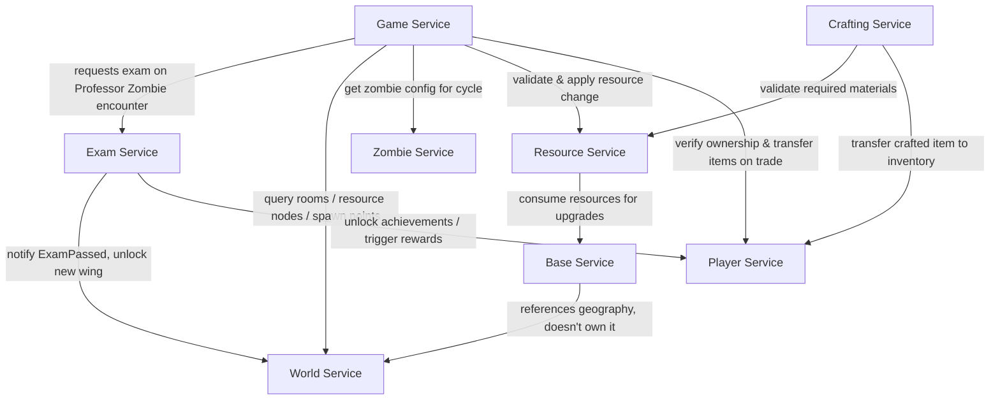

# In Kahoots with the Undead
 
**Course:** FAF.PAD21.1 — Autumn 2026
**Topic:** Topic 1 — Survive university exam season during a zombie apocalypse
**Team:** 6
 
| Name | Email | GitHub handle | Role focus |
|---|---|---|---|
| Mitu Vladlen | vladlen.mitu@gmail.com | _mituvladlen_ | Resource Service + Base Service |
| Moraru Gabriel | gabrielmoraru00@gmail.com | _TBD_ | Crafting Service + Player Service |
| Mihai Mustea | mihaimustea121@gmail.com | @MihaiM1209 | World Service + Zombie Service |
| Alexandru Bujor | alexandru.bujor@isa.utm.md | @alexandru-bujor | Game Service + Exam Service |
 
---
 
## 1. Overview
 
Players wake up in FAF Cab and must survive the semester: gathering resources,
expanding their base, clearing zombies, and still passing exams administered
by Professor Zombies. The system is split into 8 microservices, each owning
a distinct slice of state and behavior.
 
## 2. Service Boundaries
 
| Service | Owns | Does NOT own |
|---|---|---|
| **Player Service** | Identity, auth, profiles, friends, presence, XP/levels, inventory (items), trading | Gameplay session state, map, resources |
| **Game Service** | Real-time sessions/lobbies, day/night cycle, timers, timed player actions, short-lived zombie behavior during a cycle | Persistent map, player inventory, resource quantities |
| **Exam Service** | Active exams, attempts, questions, answers, grades, pass/fail, course/achievement progression | Map unlocking itself (only notifies) |
| **World Service** | Campus map: rooms, corridors, zones, resource nodes, barricades, spawn configs | Base customizations, resource quantities |
| **Zombie Service** | Zombie type definitions, stats, behavior config, sprites, abilities | Runtime zombie instances during a session (that's Game Service) |
| **Resource Service** | Resource economy: quantities, location, idempotent gather/consume operations | Physical map, base state |
| **Base Service** | Player-built state: upgrades, barricades, facilities, storage, Kiki interactions | Campus geography (World Service owns that) |
| **Crafting Service** | Recipes, crafting validation, atomic craft operations | Player inventory storage (delegates the actual item transfer to Player Service) |
 
## 3. Architecture Diagram
 

 
## 4. Technologies & Communication Patterns
 
> _To complete: team decision on the 2 languages._ Each service's language, framework, and
> communication style (REST/gRPC/messaging), with a short justification
> tying the choice to the service's needs (e.g. real-time Game Service →
> WebSockets; Exam Service → simple synchronous REST).
 
| Service | Language | Framework | Communication | Why |
|---|---|---|---|---|
| Player Service | _TypeScript_ | _Node.js_ | REST | _TBD_ |
| Game Service | Go 1.22 | net/http (standard library) + gorilla/websocket, PostgreSQL 16 | WebSockets + REST | Many concurrent timers and live connections; goroutines keep them cheap. WebSockets push action progress, cycle changes and zombie events. |
| Exam Service | Go 1.22 | net/http (standard library), PostgreSQL 16 | REST | Simple request/response; transactions keep grades and achievements consistent. |
| World Service | TypeScript 5 | Node.js 22 + Express 4, MongoDB 7 | REST | The campus map is read-heavy and document-shaped (rooms, nodes, spawn configs with nested fields), so MongoDB fits without joins. TypeScript types keep the map models consistent. |
| Zombie Service | JavaScript (ES2022) | Node.js 22 + Express 4, MongoDB 7 | REST | Small config-only service: each zombie type is one document with nested stats, behavior, sprite and abilities. Plain JavaScript keeps it light. |
| Resource Service | TypeScript 5 | Node.js 22 + Express 5, PostgreSQL 16 | REST | Mostly I/O-bound database work. PostgreSQL transactions with `actionId` as primary key make gather/consume idempotent, so a retry after a reconnect never awards twice. Same language as Player Service. |
| Base Service | TypeScript 5 | Node.js 22 + Express 5, PostgreSQL 16 | REST | Simple request/response CRUD; transactions keep upgrades consistent. Pays for upgrades through Resource Service (idempotent consume, refund if the local save fails). Same language as Player Service. |
| Crafting Service | _TBD_ | _TBD_ | REST | _TBD_ |
 
## 5. Communication Contract
 
### 5.1 Data management
- **Database per service.** Every service owns its own database; no service reads another service's database directly.
- **Access through APIs only.** Cross-service data is fetched through the REST endpoints below (and WebSockets for live Game updates).
- **Event notifications.** State changes other services care about (e.g. `ExamPassed`) are sent as HTTP POST notifications to the owning service (to be replaced by a message broker in later labs if required).
- **Idempotency.** Requests that award or consume something carry an id (`actionId`, `examId`) so retries never apply twice.
- **Format.** JSON, UTF-8, ids are UUID strings, timestamps are ISO 8601 (UTC). Errors use `{ "error": "CODE", "message": "text" }`.
### 5.2 Game Service (owner: Alexandru Bujor) — port 3001
 
| Method | Path | Request body | Success response |
|---|---|---|---|
| GET | `/health` | – | `200 { "status": "ok" }` |
| POST | `/sessions` | `{ "name": "string", "maxPlayers": 4 }` | `201 Session` |
| GET | `/sessions` | – | `200 Session[]` |
| GET | `/sessions/{sessionId}` | – | `200 Session` |
| POST | `/sessions/{sessionId}/join` | `{ "playerId": "uuid" }` | `200 Session` |
| POST | `/sessions/{sessionId}/leave` | `{ "playerId": "uuid" }` | `200 Session` |
| DELETE | `/sessions/{sessionId}` | – | `204` |
| GET | `/sessions/{sessionId}/cycle` | – | `200 { "phase": "day" \| "night", "cycleNumber": 3, "endsAt": "ISO" }` |
| POST | `/sessions/{sessionId}/actions` | `{ "playerId": "uuid", "type": "ActionType", "targetId": "uuid" }` | `202 Action` |
| GET | `/sessions/{sessionId}/actions/{actionId}` | – | `200 Action` |
| DELETE | `/sessions/{sessionId}/actions/{actionId}` | – | `200 Action` (status `cancelled`) |
| POST | `/sessions/{sessionId}/encounters` | `{ "playerId": "uuid", "zombieId": "uuid" }` | `201 Encounter` |
 
```json
// Session
{ "sessionId": "uuid", "name": "FAF Cab Survivors", "status": "waiting | active | finished",
  "maxPlayers": 4, "players": ["uuid"], "createdAt": "ISO", "startedAt": "ISO | null" }
 
// ActionType: CHOP_BENCHES (600 s) | SCAVENGE_CANTEEN (300 s) | CLEAR_ROOM (180 s)
//             | BARRICADE_ROOM (240 s) | REPAIR_BASE (300 s)
// Action
{ "actionId": "uuid", "sessionId": "uuid", "playerId": "uuid", "type": "SCAVENGE_CANTEEN",
  "targetId": "uuid", "status": "in_progress | completed | cancelled",
  "startedAt": "ISO", "endsAt": "ISO", "durationSec": 300 }
 
// Encounter
{ "encounterId": "uuid", "sessionId": "uuid", "playerId": "uuid", "zombieId": "uuid",
  "zombieType": "PROFESSOR | TOURIST",
  "outcome": "EXAM_STARTED | RESOURCES_STOLEN | XP_STOLEN", "examId": "uuid | null", "createdAt": "ISO" }
```
 
**WebSocket** `ws://<host>:3001/ws?sessionId=<uuid>&playerId=<uuid>` — server pushes:
 
```json
{ "event": "ACTION_PROGRESS",  "data": { "actionId": "uuid", "progress": 0.45 } }
{ "event": "ACTION_COMPLETED", "data": { "actionId": "uuid", "playerId": "uuid", "type": "SCAVENGE_CANTEEN" } }
{ "event": "CYCLE_CHANGED",    "data": { "phase": "night", "cycleNumber": 4 } }
{ "event": "ZOMBIE_SPAWNED",   "data": { "zombieId": "uuid", "zombieType": "TOURIST", "roomId": "uuid" } }
{ "event": "ZOMBIE_ATTACK",    "data": { "zombieId": "uuid", "playerId": "uuid", "outcome": "XP_STOLEN" } }
```
 
#### Lab 1 updates
- **Session** also returns `startedAt`, the time the first player joined, which is when the day/night cycle starts.
- **Encounter** also returns `sessionId`, `playerId`, `zombieId` and `createdAt`.
- **Encounter request:** `zombieId` is the id of a zombie type in Zombie Service (`zombieTypeId`).
- **Encounter rules:** a `PROFESSOR` zombie starts an exam (`EXAM_STARTED`). A `TOURIST` zombie steals 10 XP by day (`XP_STOLEN`) and 5 resources by night (`RESOURCES_STOLEN`).
- **WebSocket:** `ACTION_COMPLETED` data also includes `playerId`.
- **Error codes:** `VALIDATION_ERROR`, `INVALID_JSON`, `INVALID_ACTION_TYPE` (400); `SESSION_NOT_FOUND`, `ACTION_NOT_FOUND`, `PLAYER_NOT_FOUND`, `ZOMBIE_NOT_FOUND` (404); `SESSION_FULL`, `SESSION_FINISHED`, `SESSION_NOT_ACTIVE`, `PLAYER_NOT_IN_SESSION`, `ACTION_IN_PROGRESS`, `ACTION_NOT_IN_PROGRESS`, `ROOM_NOT_AVAILABLE` (409); `UPSTREAM_ERROR` (502).
**Calls Game Service makes to other services** (mocked in Lab 1, to confirm with each owner):
 
| Target | Call | Expected response |
|---|---|---|
| World | `GET /rooms?available=true` | `200 [ { "roomId", "name", "available" } ]` |
| World | `GET /spawn-points` | `200 [ { "spawnPointId", "roomId" } ]` |
| Zombie | `GET /zombie-types` | `200 [ { "zombieTypeId", "name", "kind": "PROFESSOR \| TOURIST" } ]` |
| Resource | `POST /resources/gather { playerId, nodeId, actionId, actionType }` | 2xx, idempotent by `actionId` |
| Resource | `POST /resources/steal { playerId, encounterId, amount }` | 2xx, idempotent by `encounterId` |
| Player | `GET /players/{playerId}` | 200 = exists, 404 = not found |
| Player | `PATCH /players/{playerId}/xp { delta }` | 2xx |
| Exam | `POST /exams { playerId, sessionId, zombieId }` | `201 { "examId", ... }` |
 
### 5.3 Exam Service (owner: Alexandru Bujor) — port 3002
 
| Method | Path | Request body | Success response |
|---|---|---|---|
| GET | `/health` | – | `200 { "status": "ok" }` |
| GET | `/courses` | – | `200 Course[]` |
| POST | `/courses` | `{ "name": "Linear Algebra", "category": "MATH" }` | `201 Course` |
| GET | `/courses/{courseId}` | – | `200 Course` |
| DELETE | `/courses/{courseId}` | – | `204` |
| GET | `/courses/{courseId}/questions` | – | `200 Question[]` (with `correctOption`, admin use) |
| POST | `/courses/{courseId}/questions` | `{ "text": "string", "options": ["a","b","c","d"], "correctOption": 2 }` | `201 Question` |
| POST | `/exams` | `{ "playerId": "uuid", "courseId": "uuid (optional)", "sessionId": "uuid", "zombieId": "uuid" }` | `201 Exam` |
| GET | `/exams/{examId}` | – | `200 Exam` |
| POST | `/exams/{examId}/submit` | `{ "answers": [ { "questionId": "uuid", "selectedOption": 1 } ] }` | `200 ExamResult` |
| DELETE | `/exams/{examId}` | – | `200 Exam` (status `abandoned`) |
| GET | `/players/{playerId}/exams?status=in_progress` | – | `200 Exam[]` |
| GET | `/players/{playerId}/progress` | – | `200 Progress` |
| GET | `/players/{playerId}/achievements` | – | `200 Achievement[]` |
 
```json
// Course
{ "courseId": "uuid", "name": "Linear Algebra", "category": "MATH | PROGRAMMING | NETWORKS | HUMANITIES",
  "questionCount": 5, "createdAt": "ISO" }
 
// Exam  (correct answers are never sent to the player; grade appears once passed or failed)
{ "examId": "uuid", "playerId": "uuid", "courseId": "uuid",
  "status": "in_progress | passed | failed | abandoned", "attemptNumber": 1,
  "questions": [ { "questionId": "uuid", "text": "string", "options": ["a","b","c","d"] } ],
  "grade": 8, "createdAt": "ISO", "expiresAt": "ISO" }
 
// ExamResult  (grade on the 1-10 scale, pass mark 5)
{ "examId": "uuid", "score": 4, "total": 5, "grade": 8, "passed": true, "attemptNumber": 1,
  "unlockedAchievements": [ { "code": "SURVIVED_THE_PUMPKIN", "name": "Survived the Pumpkin" } ] }
 
// Progress
{ "playerId": "uuid", "coursesPassed": 3, "coursesTotal": 8, "averageGrade": 7.7,
  "grades": [ { "courseId": "uuid", "grade": 8 } ], "diplomaProgress": 0.375 }
 
// Achievement
{ "code": "SURVIVED_THE_PUMPKIN", "name": "Survived the Pumpkin", "unlockedAt": "ISO" }
```
 
**Notifications Exam Service sends:**
 
| Target | Call | When |
|---|---|---|
| World | `POST /events/exam-passed { playerId, courseId, category, grade }` | An exam is passed (World may unlock a wing) |
| Player | `POST /players/{playerId}/rewards { source: "ACHIEVEMENT", code, xp }` | An achievement is unlocked |
 
#### Lab 1 updates
- **`POST /exams`:** `courseId` is optional. Without it, the first course (by name) the player hasn't passed is chosen.
- **`correctOption` / `selectedOption`** are 0-based indexes into `options`.
- **Exam** also returns `grade` once it is `passed` or `failed`. An exam submitted after `expiresAt` fails with grade 1.
- **Course** also returns `createdAt`. `DELETE /courses/{id}` returns `409 COURSE_HAS_EXAMS` if players already took that course.
- **Grading:** `grade = 1 + 9 × score / total`, rounded down. The pass mark is 5.
- **Error codes:** `VALIDATION_ERROR`, `INVALID_JSON`, `INVALID_ANSWER` (400); `COURSE_NOT_FOUND`, `EXAM_NOT_FOUND`, `PLAYER_NOT_FOUND` (404); `COURSE_ALREADY_PASSED`, `COURSE_HAS_NO_QUESTIONS`, `NO_COURSE_AVAILABLE`, `EXAM_IN_PROGRESS`, `EXAM_NOT_IN_PROGRESS`, `EXAM_EXPIRED`, `COURSE_HAS_EXAMS` (409); `UPSTREAM_ERROR` (502).
| Achievement | Name | Rule | XP |
|---|---|---|---|
| `SURVIVED_THE_PUMPKIN` | Survived the Pumpkin | First course passed | 50 |
| `TEACHERS_PET` | Teacher's Pet | Grade 10 | 100 |
| `RETAKE_WARRIOR` | Retake Warrior | Passed on attempt 2 or later | 30 |
| `HAT_TRICK` | Hat Trick | 3 courses passed | 150 |
| `DIPLOMA_SECURED` | Diploma Secured | Every course passed | 500 |
 
### 5.4 Resource Service (owner: Mitu Vladlen) — port 3005
 
| Method | Path | Request body | Success response |
|---|---|---|---|
| GET | `/health` | – | `200 { "status": "ok", "service": "resource-service" }` |
| GET | `/resource-types` | – | `200 ResourceType[]` |
| POST | `/resource-types` | `{ "id": "gold", "name": "Gold", "description": "string (optional)" }` | `201 ResourceType` |
| GET | `/resource-types/{id}` | – | `200 ResourceType` |
| PUT | `/resource-types/{id}` | `{ "name": "Gold", "description": "string (optional)" }` | `200 ResourceType` |
| DELETE | `/resource-types/{id}` | – | `204` |
| GET | `/players/{playerId}/resources` | – | `200 { "playerId": "uuid", "items": InventoryItem[] }` |
| GET | `/players/{playerId}/resources/{resourceTypeId}` | – | `200 InventoryItem` |
| PUT | `/players/{playerId}/resources/{resourceTypeId}` | `{ "quantity": 100 }` (admin / testing) | `200 InventoryItem` |
| DELETE | `/players/{playerId}/resources` | – (admin / testing) | `204` |
| POST | `/resources/gather` | `{ "actionId": "uuid", "playerId": "uuid", "nodeId": "uuid", "amount": 5 }` | `201 ActionResult` (`200` if duplicate) |
| POST | `/resources/consume` | `{ "actionId": "uuid", "playerId": "uuid", "items": [ { "resourceTypeId": "wood", "amount": 20 } ], "reason": "string (optional)" }` | `201 ActionResult` (`200` if duplicate) |
| POST | `/resources/grant` | `{ "actionId": "uuid", "playerId": "uuid", "items": [ { "resourceTypeId": "food", "amount": 3 } ], "source": "kiki" }` | `201 ActionResult` (`200` if duplicate) |
| GET | `/resources/actions/{actionId}` | – | `200 ResourceAction` |
| GET | `/players/{playerId}/gathers` | – | `200 ResourceAction[]` (where the player gathered) |
| GET | `/nodes/{nodeId}/gathers` | – | `200 { "nodeId": "uuid", "totals": [ { "playerId", "resourceTypeId", "amount" } ], "actions": ResourceAction[] }` |
 
```json
// ResourceType  (seeded: wood, metal_scraps, paper, food)
{ "id": "wood", "name": "Wood", "description": "Basic building material" }
 
// InventoryItem  (every resource type is listed, 0 if the player has none)
{ "playerId": "uuid", "resourceTypeId": "wood", "quantity": 50 }
 
// ResourceAction  (every change to an inventory; actionId is the idempotency key)
{ "actionId": "uuid", "kind": "gather | consume | grant", "playerId": "uuid",
  "nodeId": "uuid | null", "source": "string | null",
  "items": [ { "resourceTypeId": "wood", "amount": 5 } ], "createdAt": "ISO" }
 
// ActionResult
{ "action": ResourceAction, "duplicate": false, "inventory": InventoryItem[] }
```
 
#### Lab 1 notes
- **Idempotency:** `actionId` is the primary key of the actions table. The first request returns `201`; repeating the same `actionId` returns `200` with `"duplicate": true` and changes nothing. Reusing an `actionId` for another player or operation returns `409 ACTION_ID_REUSED`.
- **Gather:** the resource type comes from the World node (`nodeId`), so the client never chooses what it receives.
- **Consume is all-or-nothing:** it runs in one DB transaction with the inventory rows locked. If any item is short, nothing changes and the response is `409 INSUFFICIENT_RESOURCES` with `details: [ { "resourceTypeId", "required", "available" } ]`. A rejected `actionId` is not used up and can be retried.
- **Grant** is used for rewards (Kiki in Base Service) and for refunds (`<actionId>:refund`).
- **Error codes:** `VALIDATION_ERROR`, `INVALID_JSON` (400); `NOT_FOUND` (404: player, node, resource type, action); `RESOURCE_TYPE_EXISTS`, `ACTION_ID_REUSED`, `INSUFFICIENT_RESOURCES` (409); `UPSTREAM_ERROR` (502).
**Calls Resource Service makes to other services** (mocked in Lab 1, to confirm with each owner):
 
| Target | Call | Expected response |
|---|---|---|
| Player | `GET /players/{playerId}` | 200 = exists, 404 = not found |
| World | `GET /nodes/{nodeId}` | `200 { "id": "uuid", "resourceTypeId": "wood" }`, 404 = not found |
 
### 5.5 Base Service (owner: Mitu Vladlen) — port 3006
 
| Method | Path | Request body | Success response |
|---|---|---|---|
| GET | `/health` | – | `200 { "status": "ok", "service": "base-service" }` |
| GET | `/costs` | – | `200` upgrade, barricade and facility costs + Kiki reward table |
| GET | `/bases` | – | `200 Base[]` |
| POST | `/bases` | `{ "playerId": "uuid", "name": "string (optional)" }` | `201 Base` (level 1 "FAF Cab") |
| GET | `/bases/{playerId}` | – | `200 BaseDetails` |
| PATCH | `/bases/{playerId}` | `{ "name": "FAF Cab Deluxe" }` | `200 Base` |
| DELETE | `/bases/{playerId}` | – | `204` |
| GET | `/bases/{playerId}/upgrade` | – | `200 { "currentLevel": 1, "maxLevel": 5, "nextLevel": 2, "cost": ResourceAmount[], "nextStorageCapacity": 150 }` |
| POST | `/bases/{playerId}/upgrade` | `{ "actionId": "uuid" }` | `200 ActionOutcome<Base>` |
| GET | `/bases/{playerId}/barricades` | – | `200 Barricade[]` |
| POST | `/bases/{playerId}/barricades` | `{ "actionId": "uuid", "roomId": "uuid" }` | `201 ActionOutcome<Barricade>` (`200` if duplicate) |
| DELETE | `/bases/{playerId}/barricades/{barricadeId}` | – | `204` |
| GET | `/bases/{playerId}/facilities` | – | `200 Facility[]` |
| POST | `/bases/{playerId}/facilities` | `{ "actionId": "uuid", "type": "workbench \| kitchen \| library \| generator" }` | `201 ActionOutcome<Facility>` (`200` if duplicate) |
| DELETE | `/bases/{playerId}/facilities/{facilityId}` | – | `204` |
| GET | `/bases/{playerId}/decorations` | – | `200 Decoration[]` |
| POST | `/bases/{playerId}/decorations` | `{ "name": "Plant" }` | `201 Decoration` |
| DELETE | `/bases/{playerId}/decorations/{decorationId}` | – | `204` |
| GET | `/bases/{playerId}/kiki` | – | `200 KikiInteraction[]` |
| POST | `/bases/{playerId}/kiki` | `{ "actionId": "uuid" }` | `201 ActionOutcome<KikiInteraction>` (`200` if duplicate) |
 
```json
// Base  (storageCapacity = 100 + 50 × (level − 1))
{ "playerId": "uuid", "name": "FAF Cab", "level": 1, "storageCapacity": 100,
  "createdAt": "ISO", "updatedAt": "ISO" }
 
// BaseDetails
{ ...Base, "barricades": Barricade[], "facilities": Facility[], "decorations": Decoration[] }
 
// Barricade
{ "id": "uuid", "playerId": "uuid", "roomId": "uuid", "strength": 10, "createdAt": "ISO" }
 
// Facility
{ "id": "uuid", "playerId": "uuid", "type": "workbench", "level": 1, "createdAt": "ISO" }
 
// Decoration
{ "id": "uuid", "playerId": "uuid", "name": "Plant", "createdAt": "ISO" }
 
// KikiInteraction  (reward is null when Kiki brings nothing)
{ "actionId": "uuid", "playerId": "uuid", "reward": { "resourceTypeId": "food", "amount": 3 },
  "message": "Kiki brought you some snacks!", "createdAt": "ISO" }
 
// ActionOutcome<T>
{ "actionId": "uuid", "duplicate": false, "cost": [ { "resourceTypeId": "wood", "amount": 20 } ], "result": T }
```
 
| Operation | Cost |
|---|---|
| Upgrade level L → L+1 (max level 5) | wood 20·L, metal_scraps 10·L, paper 5·L |
| Barricade (one per room) | wood 10, metal_scraps 5 |
| Facility `workbench` / `kitchen` / `library` / `generator` | wood 15 + metal_scraps 5 / wood 10 + food 5 / paper 20 + wood 5 / metal_scraps 15 + wood 5 |
| Decoration (max 20) | free |
| Kiki | free; random reward: food 1–5 (30%), paper 1–4 (25%), wood 2–6 (20%), metal_scraps 1–3 (10%), nothing (15%) |
 
#### Lab 1 notes
- **Idempotency:** upgrade, barricade, facility and Kiki take an `actionId`. Repeating it returns the stored result with `"duplicate": true` and never charges or rewards twice.
- **Paying:** Base Service charges through Resource Service (`POST /resources/consume` with the same `actionId`), then saves locally in a transaction. If the local save fails after paying (e.g. two upgrades race and the level changed), it refunds with `POST /resources/grant` and `actionId = <actionId>:refund`.
- **Kiki** rewards are granted through `POST /resources/grant` with `source: "kiki"`.
- **Error codes:** `VALIDATION_ERROR`, `INVALID_JSON` (400); `NOT_FOUND` (404: player, base, room, barricade, facility, decoration); `BASE_EXISTS`, `MAX_LEVEL_REACHED`, `BASE_CHANGED`, `ROOM_ALREADY_BARRICADED`, `FACILITY_EXISTS`, `DECORATION_LIMIT`, `INSUFFICIENT_RESOURCES`, `ACTION_ID_REUSED` (409); `UPSTREAM_ERROR` (502).
**Calls Base Service makes to other services** (Player and World mocked in Lab 1; Resource is a real call):
 
| Target | Call | Expected response |
|---|---|---|
| Player | `GET /players/{playerId}` | 200 = exists, 404 = not found |
| World | `GET /rooms/{roomId}` | 200 = exists, 404 = not found |
| Resource | `POST /resources/consume { actionId, playerId, items, reason }` | `201`/`200`, `409 INSUFFICIENT_RESOURCES` |
| Resource | `POST /resources/grant { actionId, playerId, items, source }` | `201`/`200` |
 
### 5.6 World Service (owner: Mihai Mustea) — port 3011

Bodies are JSON. Errors use `{ "error": "CODE", "message": "text" }` (`VALIDATION_ERROR` 400, `NOT_FOUND` 404, `EXAM_NOT_VERIFIED` 422, `INTERNAL_ERROR` 500).

#### Health

| Method | Path | Response |
|---|---|---|
| `GET` | `/health` | `200 { "status": "ok", "service": "world-service" }` |

#### CRUD resources

Every resource below supports the same five operations:

| Method | Path | Request | Response |
|---|---|---|---|
| `GET` | `/<resource>` | optional query filters | `200 [ ... ]` |
| `GET` | `/<resource>/{id}` | - | `200 {...}`, `404` |
| `POST` | `/<resource>` | full body | `201 {...}`, `400` |
| `PUT` | `/<resource>/{id}` | full body | `200 {...}`, `400`, `404` |
| `PATCH` | `/<resource>/{id}` | partial body | `200 {...}`, `400`, `404` |
| `DELETE` | `/<resource>/{id}` | - | `204`, `404` |

| Resource | Body fields | Query filters |
|---|---|---|
| `/rooms` | `name`, `type` (`base` `canteen` `library` `laboratory` `classroom` `corridor_hub` `other`), `wingId?`, `zoneId?`, `description?` | `type`, `wingId`, `available=true` |
| `/corridors` | `fromRoomId`, `toRoomId`, `locked?` | `fromRoomId`, `toRoomId` |
| `/zones` | `name`, `description?`, `dangerLevel` (0-10) | - |
| `/resource-nodes` | `roomId`, `resourceType` (`metal_scraps` `paper` `food` `textbooks`), `quantity`, `respawnSeconds?` | `roomId`, `resourceType`, `available=true` |
| `/barricades` | `roomId`, `health`, `maxHealth` | `roomId` |
| `/spawn-configs` | `roomId`, `zombieType` (`code` from Zombie Service, e.g. `PROFESSOR`), `maxZombies`, `intervalSeconds`, `active?` | `roomId`, `zombieType` |
| `/wings` | `name`, `unlocked?`, `requiredCourseId?` | - |

#### Map queries and actions

| Method | Path | Request | Response |
|---|---|---|---|
| `GET` | `/rooms?available=true` | - | `200 [rooms]` not in a locked wing |
| `GET` | `/rooms/{id}/resource-nodes` | - | `200 [nodes]`, `404` |
| `GET` | `/resource-nodes?available=true` | - | `200 [nodes]` with quantity > 0 in available rooms |
| `GET` | `/spawn-points` | - | `200 [spawnConfigs]` active, in available rooms |
| `POST` | `/wings/{id}/unlock` | - | `200 { "wing": {...}, "alreadyUnlocked": false }`, `404` |
| `POST` | `/events/exam-passed` | `{ "playerId": "uuid", "courseId": "uuid", "category": "MIDTERM", "grade": 8.5 }` | `200 { "unlocked": [wing], "alreadyUnlocked": [wing] }` (empty lists when no wing needs that course), `400`, `422` |

`POST /events/exam-passed` is sent by the Exam Service (payload as agreed in the contract). Every wing whose `requiredCourseId` equals the `courseId` is unlocked; repeats are idempotent. In Lab 1 the Exam Service is mocked behind `ExamServiceClient` (`src/clients/examClient.ts`) and replaced by a real HTTP client in Lab 2.

#### Lab 1 notes
- **Storage:** MongoDB (`world` database), seeded by `db-scripts/world-service/seed.js` (FAF Cab, Canteen, Library, Laboratory, 2 classrooms, 1 locked wing).
- **Available rooms:** a room is available when it has no wing or its wing is unlocked. Resource nodes and spawn points follow the same rule.
- **Resource types:** Laboratory = `metal_scraps`, Library = `paper`, Canteen = `food`, Classrooms = `textbooks`.
- **Unlocking:** a wing has an optional `requiredCourseId`. `POST /events/exam-passed` unlocks every wing whose `requiredCourseId` equals the `courseId`, and is idempotent.
- **Spawn configs** reference a zombie type by its Zombie Service `code` (e.g. `PROFESSOR`).

**Calls World Service receives from other services:**

| From | Call | When |
|---|---|---|
| Exam | `POST /events/exam-passed { playerId, courseId, category, grade }` | An exam is passed (mocked in Lab 1 behind `ExamServiceClient`) |
| Game | `GET /rooms?available=true`, `GET /rooms/{roomId}/resource-nodes`, `GET /spawn-points` | Where players can act, where zombies spawn |

### 5.7 Zombie Service (owner: Mihai Mustea) — port 3012

Bodies are JSON. Errors use `{ "error": "CODE", "message": "text" }`: `VALIDATION_ERROR` 400, `NOT_FOUND` 404, `CONFLICT` 409 (duplicate name or code), `INTERNAL_ERROR` 500.

| Method | Path | Request | Response |
|---|---|---|---|
| `GET` | `/health` | - | `200 { "status": "ok", "service": "zombie-service" }` |
| `GET` | `/zombie-types` | query `name`, `code`, `behaviorMode` (optional) | `200 [ zombieType ]` |
| `POST` | `/zombie-types` | full zombie type | `201 zombieType`, `400`, `409` |
| `GET` | `/zombie-types/{id}` | - | `200 zombieType`, `404` |
| `PUT` | `/zombie-types/{id}` | full zombie type | `200 zombieType`, `400`, `404`, `409` |
| `PATCH` | `/zombie-types/{id}` | partial zombie type | `200 zombieType`, `400`, `404` |
| `DELETE` | `/zombie-types/{id}` | - | `204`, `404` |
| `GET` | `/zombie-types/{id}/stats` | - | `200 stats`, `404` |
| `PATCH` | `/zombie-types/{id}/stats` | partial stats | `200 stats`, `400`, `404` |
| `GET` | `/zombie-types/{id}/behavior` | - | `200 behavior`, `404` |
| `PUT` | `/zombie-types/{id}/behavior` | behavior | `200 behavior`, `400`, `404` |
| `GET` | `/zombie-types/{id}/sprite` | - | `200 sprite`, `404` |
| `PUT` | `/zombie-types/{id}/sprite` | sprite | `200 sprite`, `400`, `404` |
| `GET` | `/zombie-types/{id}/abilities` | - | `200 [ ability ]`, `404` |
| `POST` | `/zombie-types/{id}/abilities` | ability | `201 ability`, `400`, `404`, `409` |
| `DELETE` | `/zombie-types/{id}/abilities/{name}` | - | `204`, `404` |

#### Lab 1 notes
- **Storage:** MongoDB (`zombie` database), seeded by `db-scripts/zombie-service/seed.js` with four types: `PROFESSOR`, `TOURIST`, `OVERWORKED_STUDENT`, `DEAN`.
- **Standalone:** Zombie Service calls no other service, so there is nothing to mock. It only stores definitions; live zombies belong to Game Service.
- **Uniqueness:** `code` and `name` are both unique (`409 CONFLICT`).

**Calls Zombie Service receives from other services:**

| From | Call | When |
|---|---|---|
| Game | `GET /zombie-types` | Zombie configs for the cycle |

### 5.8 Crafting, Player
_To be filled in by each owner in the same format._
 
## 6. GitHub Workflow
 
### Branches
| Branch | Purpose | Who pushes |
|---|---|---|
| `main` | Stable, presented version of each lab | Only via PR from `development` |
| `development` | Integration branch | Only via PR from feature branches |
| `feature/<service>-<short-desc>` | New work, e.g. `feature/game-timed-actions` | Author |
| `fix/<service>-<short-desc>` | Bug fixes, e.g. `fix/exam-grading-rounding` | Author |
| `docs/<short-desc>` | README / contract changes | Author |
 
### Rules
- Direct pushes to `main` and `development` are blocked (branch protection).
- Every PR needs **1 approval** from a teammate before merging.
- Merge strategy: **squash and merge** (one clean commit per PR).
- Commit messages follow Conventional Commits: `feat:`, `fix:`, `docs:`, `test:`, `chore:`, `refactor:`.
- Every PR uses the template in `.github/pull_request_template.md` (description, affected services, linked task, how it was tested).
- **Test coverage:** each service must keep unit test coverage at **80% or more**; PRs that lower it below 80% are not merged.
- **Versioning:** Semantic Versioning `MAJOR.MINOR.PATCH`. DockerHub tags match the version (`<user>/<service>:1.0.0`). Bump MINOR for new endpoints, PATCH for fixes, MAJOR for contract-breaking changes.
- `development` is merged into `main` before each lab presentation.
- Never commit `.env` files, API keys or `node_modules/`; commit `.env.example` with placeholder values instead.
### Repository structure
```
kahoots-with-the-undead/
├── services/        # private microservice repos, linked as git submodules
├── postman/         # Postman collections, one per service
├── deploy/          # docker-compose.yml (DockerHub images only)
├── db-scripts/      # seed scripts, one folder per service
└── .github/         # PR template
```
 
### Cloning with submodules
```bash
git clone --recurse-submodules <CPR-url>
# or, if already cloned:
git submodule update --init --recursive
```
(Private submodules are only accessible to their owner and the professor.)
 
## 7. Repository Links
 
| Service | DockerHub | Private Repo (submodule) |
|---|---|---|
| Player Service | _TBD_ | _TBD_ |
| Game Service | [alexandrubujor1/game-service:1.0.0](https://hub.docker.com/r/alexandrubujor1/game-service) | [game-service](https://github.com/kahoots-undead-faf-team-6/game-service) (private) |
| Exam Service | [alexandrubujor1/exam-service:1.0.0](https://hub.docker.com/r/alexandrubujor1/exam-service) | [exam-service](https://github.com/kahoots-undead-faf-team-6/exam-service) (private) |
| World Service | [mihaim888/world-service:2.0.0](https://hub.docker.com/r/mihaim888/world-service) | [world-service](https://github.com/kahoots-undead-faf-team-6/world-service) (private) |
| Zombie Service | [mihaim888/zombie-service:2.0.0](https://hub.docker.com/r/mihaim888/zombie-service) | [zombie-service](https://github.com/kahoots-undead-faf-team-6/zombie-service) (private) |
| Resource Service | [mituvladlen/resource-service:1.0.0](https://hub.docker.com/r/mituvladlen/resource-service) | [resource-service](https://github.com/kahoots-undead-faf-team-6/resource-service) (private) |
| Base Service | [mituvladlen/base-service:1.0.0](https://hub.docker.com/r/mituvladlen/base-service) | [base-service](https://github.com/kahoots-undead-faf-team-6/base-service) (private) |
| Crafting Service | _TBD_ | _TBD_ |
 
## 8. Postman Collections
 
Postman collections for each service live in [`/postman`](./postman).
 
- `game-service.postman_collection.json`: Game Service (port 3001)
- `world-service.postman_collection.json`: World Service (port 3011)
- `zombie-service.postman_collection.json`: Zombie Service (port 3012)
- `exam-service.postman_collection.json`: Exam Service (port 3002)
- `resource-service.postman_collection.json`: Resource Service (port 3005)
- `base-service.postman_collection.json`: Base Service (port 3006)
Import a collection and run it with the Collection Runner. Player ids are generated on each run, so the collections can be run repeatedly.
 
## 9. Project Board
 
Track lab tasks on the linked [GitHub Project](#).
 
## 10. Running the Services
 
**Requirements:** Docker Engine 24+ with Docker Compose v2.
 
| Service | Port | Database | Seed data |
|---|---|---|---|
| World Service | 3011 | MongoDB 7 (`world-mongo`, host port 27011) | `db-scripts/world-service/` |
| Zombie Service | 3012 | MongoDB 7 (`zombie-mongo`, host port 27012) | `db-scripts/zombie-service/` |
| Game Service | 3001 | PostgreSQL 16 (`game-db`) | `db-scripts/game-service/` |
| Exam Service | 3002 | PostgreSQL 16 (`exam-db`) | `db-scripts/exam-service/` |
| Resource Service | 3005 | PostgreSQL 16 (`resource-db`) | `db-scripts/resource-service/` |
| Base Service | 3006 | PostgreSQL 16 (`base-db`) | `db-scripts/base-service/` |
 
```bash
cp deploy/.env.example deploy/.env    # set every password
docker compose -f deploy/docker-compose.yml --env-file deploy/.env up -d
curl http://localhost:3001/health
curl http://localhost:3002/health
curl http://localhost:3005/health
curl http://localhost:3006/health
```
 
Each database is created and seeded automatically on the first start. To reseed by hand: `./db-scripts/seed.sh <service>`.

World and Zombie use MongoDB and are seeded by hand (they skip if the database is not empty): `cd db-scripts/world-service && npm install && MONGO_URI=... node seed.js`, same for `zombie-service`. Health checks: `curl http://localhost:3011/health` and `curl http://localhost:3012/health`.
 
## 11. Changelog
 
- **Lab 1 (v1.0.0), Game + Exam:** CRUD services in Go, PostgreSQL per service with volumes, public DockerHub images, seed scripts, Postman collections, unit test coverage of 96–98%, mocks for World, Zombie, Resource and Player.
- **Lab 1 (v1.0.0), Resource + Base:** CRUD services in TypeScript (Node.js 22, Express 5), PostgreSQL per service with volumes, public DockerHub images, seed scripts, Postman collections, unit test coverage of ~100%, mocks for Player and World; Base Service calls Resource Service over HTTP (idempotent consume/grant with refund on failure).
- **Lab 1 (v2.0.0), World + Zombie:** CRUD services in TypeScript (World) and JavaScript (Zombie) on Node.js 22 + Express, MongoDB per service with named volumes, public DockerHub images, seed scripts, Postman collections, unit test coverage of ~100%, mocked Exam Service for `ExamPassed` behind `ExamServiceClient`.
