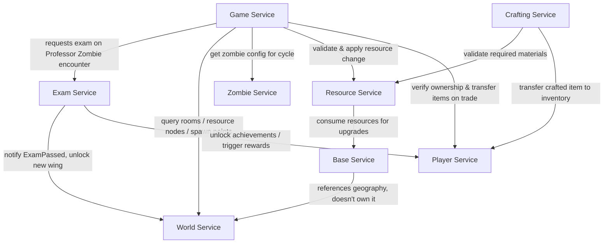

# In Kahoots with the Undead

**Course:** FAF.PAD21.1 — Autumn 2026
**Topic:** Topic 1 — Survive university exam season during a zombie apocalypse
**Team:** 6

| Name | Email | GitHub handle | Role focus |
|---|---|---|---|
| Mitu Vladlen | vladlen.mitu@gmail.com | _TBD_ | Resource Service + Base Service |
| Moraru Gabriel | gabrielmoraru00@gmail.com | _TBD_ | Crafting Service + Player Service |
| Mihai Mustea | mihaimustea121@gmail.com | MihaiM1209 | World Service + Zombie Service |
| Alexandru Bujor | alexandru.bujor@isa.utm.md | _TBD_ | Game Service + Exam Service |

---

## 1. Overview

Players wake up in FAF Cab and must survive the semester: gathering resources,
expanding their base, clearing zombies, and still passing exams administered
by Professor Zombies. The system is split into 8 microservices, each owning
a distinct slice of state and behavior.

## 2. Service Boundaries

| Service | Owns | Does NOT own |
|---|---|---|
| **Player Service** | Identity, auth, profiles, friends, presence, XP/levels, inventory (items), trading | Gameplay session state, map, resources |
| **Game Service** | Real-time sessions/lobbies, day/night cycle, timers, timed player actions, short-lived zombie behavior during a cycle | Persistent map, player inventory, resource quantities |
| **Exam Service** | Active exams, attempts, questions, answers, grades, pass/fail, course/achievement progression | Map unlocking itself (only notifies) |
| **World Service** | Campus map: rooms, corridors, zones, resource nodes, barricades, spawn configs | Base customizations, resource quantities |
| **Zombie Service** | Zombie type definitions, stats, behavior config, sprites, abilities | Runtime zombie instances during a session (that's Game Service) |
| **Resource Service** | Resource economy: quantities, location, idempotent gather/consume operations | Physical map, base state |
| **Base Service** | Player-built state: upgrades, barricades, facilities, storage, Kiki interactions | Campus geography (World Service owns that) |
| **Crafting Service** | Recipes, crafting validation, atomic craft operations | Player inventory storage (delegates the actual item transfer to Player Service) |

## 3. Architecture Diagram



## 4. Technologies & Communication Patterns

> _To complete: team decision on the 2 languages._ Each service's language, framework, and
> communication style (REST/gRPC/messaging), with a short justification
> tying the choice to the service's needs (e.g. real-time Game Service →
> WebSockets; Exam Service → simple synchronous REST).

| Service | Language | Framework | Communication | Why |
|---|---|---|---|---|
| Player Service | _TBD_ | _TBD_ | REST | _TBD_ |
| Game Service | _TBD_ | _TBD_ | WebSockets + REST | Needs live progress updates |
| Exam Service | _TBD_ | _TBD_ | REST | Simple request/response |
| World Service | TypeScript (Node.js) | Express | REST | Map is read-heavy, document-shaped JSON; TypeScript types keep the map models safe |
| Zombie Service | JavaScript (Node.js) | Express | REST | Small config-only service, plain JS keeps it light |
| Resource Service | _TBD_ | _TBD_ | REST | Needs idempotency for reconnects |
| Base Service | _TBD_ | _TBD_ | REST | _TBD_ |
| Crafting Service | _TBD_ | _TBD_ | REST | _TBD_ |

## 5. Communication Contract

> _Each member fills in the endpoints of their services._ List every endpoint per service: method, path,
> request body, response body, status codes. Example format below.

### Example — Resource Service

| Endpoint | Method | Request | Response |
|---|---|---|---|
| `/resources/{nodeId}/gather` | `POST` | `{ "playerId": "uuid", "actionId": "uuid" }` | `201 { "resourceType": "wood", "amount": 12 }` |

### World Service

Bodies are JSON. Errors use `{ "error": "CODE", "message": "text" }` (`VALIDATION_ERROR` 400, `NOT_FOUND` 404, `EXAM_NOT_VERIFIED` 422, `INTERNAL_ERROR` 500).

#### Health

| Method | Path | Response |
|---|---|---|
| `GET` | `/health` | `200 { "status": "ok", "service": "world-service" }` |

#### CRUD resources

Every resource below supports the same five operations:

| Method | Path | Request | Response |
|---|---|---|---|
| `GET` | `/<resource>` | optional query filters | `200 [ ... ]` |
| `GET` | `/<resource>/{id}` | - | `200 {...}`, `404` |
| `POST` | `/<resource>` | full body | `201 {...}`, `400` |
| `PUT` | `/<resource>/{id}` | full body | `200 {...}`, `400`, `404` |
| `PATCH` | `/<resource>/{id}` | partial body | `200 {...}`, `400`, `404` |
| `DELETE` | `/<resource>/{id}` | - | `204`, `404` |

| Resource | Body fields | Query filters |
|---|---|---|
| `/rooms` | `name`, `type` (`base` `canteen` `library` `laboratory` `classroom` `corridor_hub` `other`), `wingId?`, `zoneId?`, `description?` | `type`, `wingId`, `available=true` |
| `/corridors` | `fromRoomId`, `toRoomId`, `locked?` | `fromRoomId`, `toRoomId` |
| `/zones` | `name`, `description?`, `dangerLevel` (0-10) | - |
| `/resource-nodes` | `roomId`, `resourceType` (`metal_scraps` `paper` `food` `textbooks`), `quantity`, `respawnSeconds?` | `roomId`, `resourceType`, `available=true` |
| `/barricades` | `roomId`, `health`, `maxHealth` | `roomId` |
| `/spawn-configs` | `roomId`, `zombieType` (`code` from Zombie Service, e.g. `PROFESSOR`), `maxZombies`, `intervalSeconds`, `active?` | `roomId`, `zombieType` |
| `/wings` | `name`, `unlocked?`, `requiredCourseId?` | - |

#### Map queries and actions

| Method | Path | Request | Response |
|---|---|---|---|
| `GET` | `/rooms?available=true` | - | `200 [rooms]` not in a locked wing |
| `GET` | `/rooms/{id}/resource-nodes` | - | `200 [nodes]`, `404` |
| `GET` | `/resource-nodes?available=true` | - | `200 [nodes]` with quantity > 0 in available rooms |
| `GET` | `/spawn-points` | - | `200 [spawnConfigs]` active, in available rooms |
| `POST` | `/wings/{id}/unlock` | - | `200 { "wing": {...}, "alreadyUnlocked": false }`, `404` |
| `POST` | `/events/exam-passed` | `{ "playerId": "uuid", "courseId": "uuid", "category": "MIDTERM", "grade": 8.5 }` | `200 { "unlocked": [wing], "alreadyUnlocked": [wing] }` (empty lists when no wing needs that course), `400`, `422` |

`POST /events/exam-passed` is sent by the Exam Service (payload as agreed in the contract). Every wing whose `requiredCourseId` equals the `courseId` is unlocked; repeats are idempotent. In Lab 1 the Exam Service is mocked behind `ExamServiceClient` (`src/clients/examClient.ts`) and replaced by a real HTTP client in Lab 2.

### Zombie Service

Bodies are JSON. Errors use `{ "error": "CODE", "message": "text" }`: `VALIDATION_ERROR` 400, `NOT_FOUND` 404, `CONFLICT` 409 (duplicate name or code), `INTERNAL_ERROR` 500.

| Method | Path | Request | Response |
|---|---|---|---|
| `GET` | `/health` | - | `200 { "status": "ok", "service": "zombie-service" }` |
| `GET` | `/zombie-types` | query `name`, `code`, `behaviorMode` (optional) | `200 [ zombieType ]` |
| `POST` | `/zombie-types` | full zombie type | `201 zombieType`, `400`, `409` |
| `GET` | `/zombie-types/{id}` | - | `200 zombieType`, `404` |
| `PUT` | `/zombie-types/{id}` | full zombie type | `200 zombieType`, `400`, `404`, `409` |
| `PATCH` | `/zombie-types/{id}` | partial zombie type | `200 zombieType`, `400`, `404` |
| `DELETE` | `/zombie-types/{id}` | - | `204`, `404` |
| `GET` | `/zombie-types/{id}/stats` | - | `200 stats`, `404` |
| `PATCH` | `/zombie-types/{id}/stats` | partial stats | `200 stats`, `400`, `404` |
| `GET` | `/zombie-types/{id}/behavior` | - | `200 behavior`, `404` |
| `PUT` | `/zombie-types/{id}/behavior` | behavior | `200 behavior`, `400`, `404` |
| `GET` | `/zombie-types/{id}/sprite` | - | `200 sprite`, `404` |
| `PUT` | `/zombie-types/{id}/sprite` | sprite | `200 sprite`, `400`, `404` |
| `GET` | `/zombie-types/{id}/abilities` | - | `200 [ ability ]`, `404` |
| `POST` | `/zombie-types/{id}/abilities` | ability | `201 ability`, `400`, `404`, `409` |
| `DELETE` | `/zombie-types/{id}/abilities/{name}` | - | `204`, `404` |

## 6. GitHub Workflow

### Branches
| Branch | Purpose | Who pushes |
|---|---|---|
| `main` | Stable, presented version of each lab | Only via PR from `development` |
| `development` | Integration branch | Only via PR from feature branches |
| `feature/<service>-<short-desc>` | New work, e.g. `feature/game-timed-actions` | Author |
| `fix/<service>-<short-desc>` | Bug fixes, e.g. `fix/exam-grading-rounding` | Author |
| `docs/<short-desc>` | README / contract changes | Author |

### Rules
- Direct pushes to `main` and `development` are blocked (branch protection).
- Every PR needs **1 approval** from a teammate before merging.
- Merge strategy: **squash and merge** (one clean commit per PR).
- Commit messages follow Conventional Commits: `feat:`, `fix:`, `docs:`, `test:`, `chore:`, `refactor:`.
- Every PR uses the template in `.github/pull_request_template.md` (description, affected services, linked task, how it was tested).
- **Test coverage:** each service must keep unit test coverage at **80% or more**; PRs that lower it below 80% are not merged.
- **Versioning:** Semantic Versioning `MAJOR.MINOR.PATCH`. DockerHub tags match the version (`<user>/<service>:1.0.0`). Bump MINOR for new endpoints, PATCH for fixes, MAJOR for contract-breaking changes.
- `development` is merged into `main` before each lab presentation.
- Never commit `.env` files, API keys or `node_modules/`; commit `.env.example` with placeholder values instead.

### Repository structure
```
kahoots-with-the-undead/
├── services/        # private microservice repos, linked as git submodules
├── postman/         # Postman collections, one per service
├── deploy/          # docker-compose.yml (DockerHub images only)
├── db-scripts/      # seed scripts, one folder per service
└── .github/         # PR template
```

### Cloning with submodules
```bash
git clone --recurse-submodules <CPR-url>
# or, if already cloned:
git submodule update --init --recursive
```
(Private submodules are only accessible to their owner and the professor.)

## 7. Repository Links

| Service | DockerHub | Private Repo (submodule) |
|---|---|---|
| Player Service | _TBD_ | _TBD_ |
| Game Service | _TBD_ | _TBD_ |
| Exam Service | _TBD_ | _TBD_ |
| World Service | https://hub.docker.com/r/mihaim888/world-service (`mihaim888/world-service:2.0.0`) | https://github.com/kahoots-undead-faf-team-6/world-service |
| Zombie Service | https://hub.docker.com/r/mihaim888/zombie-service (`mihaim888/zombie-service:2.0.0`) | https://github.com/kahoots-undead-faf-team-6/zombie-service |
| Resource Service | _TBD_ | _TBD_ |
| Base Service | _TBD_ | _TBD_ |
| Crafting Service | _TBD_ | _TBD_ |

### Run requirements (World + Zombie)

- Node.js 22+ for `run.sh`, or Docker for the images.
- World Service: port `3011`; Zombie Service: port `3012` (Game and Exam use 3001 and 3002). Env vars: `PORT`, `STORAGE` (`memory`|`mongo`), `MONGO_URI`, `MONGO_DB` (see each repo's `.env.example`).
- MongoDB 7 with a named volume; credentials only in `deploy/.env` (see `deploy/.env.example`). Host ports: World DB `27011`, Zombie DB `27012`.
- Seed once with `db-scripts/world-service/seed.js` and `db-scripts/zombie-service/seed.js` (they skip if the DB is not empty).
- Run everything: `cd deploy && cp .env.example .env && docker compose up -d`.

## 8. Postman Collections

Postman collections for each service live in [`/postman`](./postman).

## 9. Project Board

Track lab tasks on the linked [GitHub Project](#).
