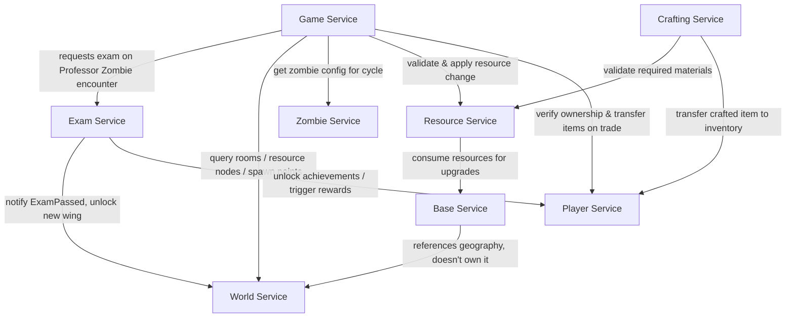

# In Kahoots with the Undead

**Course:** FAF.PAD21.1 — Autumn 2026
**Topic:** Topic 1 — Survive university exam season during a zombie apocalypse
**Team:** 6

| Name | Email | GitHub handle | Role focus |
|---|---|---|---|
| Mitu Vladlen | vladlen.mitu@gmail.com | _TBD_ | Resource Service + Base Service |
| Moraru Gabriel | gabrielmoraru00@gmail.com | _TBD_ | Crafting Service + Player Service |
| Mihai Mustea | mihaimustea121@gmail.com | _TBD_ | World Service + Zombie Service |
| Alexandru Bujor | alexandru.bujor@isa.utm.md | @AlexanderMcMarshall | Game Service + Exam Service |

---

## 1. Overview

Players wake up in FAF Cab and must survive the semester: gathering resources,
expanding their base, clearing zombies, and still passing exams administered
by Professor Zombies. The system is split into 8 microservices, each owning
a distinct slice of state and behavior.

## 2. Service Boundaries

| Service | Owns | Does NOT own |
|---|---|---|
| **Player Service** | Identity, auth, profiles, friends, presence, XP/levels, inventory (items), trading | Gameplay session state, map, resources |
| **Game Service** | Real-time sessions/lobbies, day/night cycle, timers, timed player actions, short-lived zombie behavior during a cycle | Persistent map, player inventory, resource quantities |
| **Exam Service** | Active exams, attempts, questions, answers, grades, pass/fail, course/achievement progression | Map unlocking itself (only notifies) |
| **World Service** | Campus map: rooms, corridors, zones, resource nodes, barricades, spawn configs | Base customizations, resource quantities |
| **Zombie Service** | Zombie type definitions, stats, behavior config, sprites, abilities | Runtime zombie instances during a session (that's Game Service) |
| **Resource Service** | Resource economy: quantities, location, idempotent gather/consume operations | Physical map, base state |
| **Base Service** | Player-built state: upgrades, barricades, facilities, storage, Kiki interactions | Campus geography (World Service owns that) |
| **Crafting Service** | Recipes, crafting validation, atomic craft operations | Player inventory storage (delegates the actual item transfer to Player Service) |

## 3. Architecture Diagram



## 4. Technologies & Communication Patterns

> _To complete: team decision on the 2 languages._ Each service's language, framework, and
> communication style (REST/gRPC/messaging), with a short justification
> tying the choice to the service's needs (e.g. real-time Game Service →
> WebSockets; Exam Service → simple synchronous REST).

| Service | Language | Framework | Communication | Why |
|---|---|---|---|---|
| Player Service | _TBD_ | _TBD_ | REST | _TBD_ |
| Game Service | Go 1.22 | net/http (standard library) + gorilla/websocket, PostgreSQL 16 | WebSockets + REST | Many concurrent timers and live connections; goroutines keep them cheap. WebSockets push action progress, cycle changes and zombie events. |
| Exam Service | Go 1.22 | net/http (standard library), PostgreSQL 16 | REST | Simple request/response; transactions keep grades and achievements consistent. |
| World Service | _TBD_ | _TBD_ | REST | _TBD_ |
| Zombie Service | _TBD_ | _TBD_ | REST | _TBD_ |
| Resource Service | _TBD_ | _TBD_ | REST | Needs idempotency for reconnects |
| Base Service | _TBD_ | _TBD_ | REST | _TBD_ |
| Crafting Service | _TBD_ | _TBD_ | REST | _TBD_ |

## 5. Communication Contract

### 5.1 Data management
- **Database per service.** Every service owns its own database; no service reads another service's database directly.
- **Access through APIs only.** Cross-service data is fetched through the REST endpoints below (and WebSockets for live Game updates).
- **Event notifications.** State changes other services care about (e.g. `ExamPassed`) are sent as HTTP POST notifications to the owning service (to be replaced by a message broker in later labs if required).
- **Idempotency.** Requests that award or consume something carry an id (`actionId`, `examId`) so retries never apply twice.
- **Format.** JSON, UTF-8, ids are UUID strings, timestamps are ISO 8601 (UTC). Errors use `{ "error": "CODE", "message": "text" }`.

### 5.2 Game Service (owner: Alexandru Bujor) — port 3001

| Method | Path | Request body | Success response |
|---|---|---|---|
| GET | `/health` | – | `200 { "status": "ok" }` |
| POST | `/sessions` | `{ "name": "string", "maxPlayers": 4 }` | `201 Session` |
| GET | `/sessions` | – | `200 Session[]` |
| GET | `/sessions/{sessionId}` | – | `200 Session` |
| POST | `/sessions/{sessionId}/join` | `{ "playerId": "uuid" }` | `200 Session` |
| POST | `/sessions/{sessionId}/leave` | `{ "playerId": "uuid" }` | `200 Session` |
| DELETE | `/sessions/{sessionId}` | – | `204` |
| GET | `/sessions/{sessionId}/cycle` | – | `200 { "phase": "day" \| "night", "cycleNumber": 3, "endsAt": "ISO" }` |
| POST | `/sessions/{sessionId}/actions` | `{ "playerId": "uuid", "type": "ActionType", "targetId": "uuid" }` | `202 Action` |
| GET | `/sessions/{sessionId}/actions/{actionId}` | – | `200 Action` |
| DELETE | `/sessions/{sessionId}/actions/{actionId}` | – | `200 Action` (status `cancelled`) |
| POST | `/sessions/{sessionId}/encounters` | `{ "playerId": "uuid", "zombieId": "uuid" }` | `201 Encounter` |

```json
// Session
{ "sessionId": "uuid", "name": "FAF Cab Survivors", "status": "waiting | active | finished",
  "maxPlayers": 4, "players": ["uuid"], "createdAt": "ISO", "startedAt": "ISO | null" }

// ActionType: CHOP_BENCHES (600 s) | SCAVENGE_CANTEEN (300 s) | CLEAR_ROOM (180 s)
//             | BARRICADE_ROOM (240 s) | REPAIR_BASE (300 s)
// Action
{ "actionId": "uuid", "sessionId": "uuid", "playerId": "uuid", "type": "SCAVENGE_CANTEEN",
  "targetId": "uuid", "status": "in_progress | completed | cancelled",
  "startedAt": "ISO", "endsAt": "ISO", "durationSec": 300 }

// Encounter
{ "encounterId": "uuid", "sessionId": "uuid", "playerId": "uuid", "zombieId": "uuid",
  "zombieType": "PROFESSOR | TOURIST",
  "outcome": "EXAM_STARTED | RESOURCES_STOLEN | XP_STOLEN", "examId": "uuid | null", "createdAt": "ISO" }
```

**WebSocket** `ws://<host>:3001/ws?sessionId=<uuid>&playerId=<uuid>` — server pushes:

```json
{ "event": "ACTION_PROGRESS",  "data": { "actionId": "uuid", "progress": 0.45 } }
{ "event": "ACTION_COMPLETED", "data": { "actionId": "uuid", "playerId": "uuid", "type": "SCAVENGE_CANTEEN" } }
{ "event": "CYCLE_CHANGED",    "data": { "phase": "night", "cycleNumber": 4 } }
{ "event": "ZOMBIE_SPAWNED",   "data": { "zombieId": "uuid", "zombieType": "TOURIST", "roomId": "uuid" } }
{ "event": "ZOMBIE_ATTACK",    "data": { "zombieId": "uuid", "playerId": "uuid", "outcome": "XP_STOLEN" } }
```

#### Lab 1 updates
- **Session** also returns `startedAt`, the time the first player joined, which is when the day/night cycle starts.
- **Encounter** also returns `sessionId`, `playerId`, `zombieId` and `createdAt`.
- **Encounter request:** `zombieId` is the id of a zombie type in Zombie Service (`zombieTypeId`).
- **Encounter rules:** a `PROFESSOR` zombie starts an exam (`EXAM_STARTED`). A `TOURIST` zombie steals 10 XP by day (`XP_STOLEN`) and 5 resources by night (`RESOURCES_STOLEN`).
- **WebSocket:** `ACTION_COMPLETED` data also includes `playerId`.
- **Error codes:** `VALIDATION_ERROR`, `INVALID_JSON`, `INVALID_ACTION_TYPE` (400); `SESSION_NOT_FOUND`, `ACTION_NOT_FOUND`, `PLAYER_NOT_FOUND`, `ZOMBIE_NOT_FOUND` (404); `SESSION_FULL`, `SESSION_FINISHED`, `SESSION_NOT_ACTIVE`, `PLAYER_NOT_IN_SESSION`, `ACTION_IN_PROGRESS`, `ACTION_NOT_IN_PROGRESS`, `ROOM_NOT_AVAILABLE` (409); `UPSTREAM_ERROR` (502).

**Calls Game Service makes to other services** (mocked in Lab 1, to confirm with each owner):

| Target | Call | Expected response |
|---|---|---|
| World | `GET /rooms?available=true` | `200 [ { "roomId", "name", "available" } ]` |
| World | `GET /spawn-points` | `200 [ { "spawnPointId", "roomId" } ]` |
| Zombie | `GET /zombie-types` | `200 [ { "zombieTypeId", "name", "kind": "PROFESSOR \| TOURIST" } ]` |
| Resource | `POST /resources/gather { playerId, nodeId, actionId, actionType }` | 2xx, idempotent by `actionId` |
| Resource | `POST /resources/steal { playerId, encounterId, amount }` | 2xx, idempotent by `encounterId` |
| Player | `GET /players/{playerId}` | 200 = exists, 404 = not found |
| Player | `PATCH /players/{playerId}/xp { delta }` | 2xx |
| Exam | `POST /exams { playerId, sessionId, zombieId }` | `201 { "examId", ... }` |

### 5.3 Exam Service (owner: Alexandru Bujor) — port 3002

| Method | Path | Request body | Success response |
|---|---|---|---|
| GET | `/health` | – | `200 { "status": "ok" }` |
| GET | `/courses` | – | `200 Course[]` |
| POST | `/courses` | `{ "name": "Linear Algebra", "category": "MATH" }` | `201 Course` |
| GET | `/courses/{courseId}` | – | `200 Course` |
| DELETE | `/courses/{courseId}` | – | `204` |
| GET | `/courses/{courseId}/questions` | – | `200 Question[]` (with `correctOption`, admin use) |
| POST | `/courses/{courseId}/questions` | `{ "text": "string", "options": ["a","b","c","d"], "correctOption": 2 }` | `201 Question` |
| POST | `/exams` | `{ "playerId": "uuid", "courseId": "uuid (optional)", "sessionId": "uuid", "zombieId": "uuid" }` | `201 Exam` |
| GET | `/exams/{examId}` | – | `200 Exam` |
| POST | `/exams/{examId}/submit` | `{ "answers": [ { "questionId": "uuid", "selectedOption": 1 } ] }` | `200 ExamResult` |
| DELETE | `/exams/{examId}` | – | `200 Exam` (status `abandoned`) |
| GET | `/players/{playerId}/exams?status=in_progress` | – | `200 Exam[]` |
| GET | `/players/{playerId}/progress` | – | `200 Progress` |
| GET | `/players/{playerId}/achievements` | – | `200 Achievement[]` |

```json
// Course
{ "courseId": "uuid", "name": "Linear Algebra", "category": "MATH | PROGRAMMING | NETWORKS | HUMANITIES",
  "questionCount": 5, "createdAt": "ISO" }

// Exam  (correct answers are never sent to the player; grade appears once passed or failed)
{ "examId": "uuid", "playerId": "uuid", "courseId": "uuid",
  "status": "in_progress | passed | failed | abandoned", "attemptNumber": 1,
  "questions": [ { "questionId": "uuid", "text": "string", "options": ["a","b","c","d"] } ],
  "grade": 8, "createdAt": "ISO", "expiresAt": "ISO" }

// ExamResult  (grade on the 1-10 scale, pass mark 5)
{ "examId": "uuid", "score": 4, "total": 5, "grade": 8, "passed": true, "attemptNumber": 1,
  "unlockedAchievements": [ { "code": "SURVIVED_THE_PUMPKIN", "name": "Survived the Pumpkin" } ] }

// Progress
{ "playerId": "uuid", "coursesPassed": 3, "coursesTotal": 8, "averageGrade": 7.7,
  "grades": [ { "courseId": "uuid", "grade": 8 } ], "diplomaProgress": 0.375 }

// Achievement
{ "code": "SURVIVED_THE_PUMPKIN", "name": "Survived the Pumpkin", "unlockedAt": "ISO" }
```

**Notifications Exam Service sends:**

| Target | Call | When |
|---|---|---|
| World | `POST /events/exam-passed { playerId, courseId, category, grade }` | An exam is passed (World may unlock a wing) |
| Player | `POST /players/{playerId}/rewards { source: "ACHIEVEMENT", code, xp }` | An achievement is unlocked |

#### Lab 1 updates
- **`POST /exams`:** `courseId` is optional. Without it, the first course (by name) the player hasn't passed is chosen.
- **`correctOption` / `selectedOption`** are 0-based indexes into `options`.
- **Exam** also returns `grade` once it is `passed` or `failed`. An exam submitted after `expiresAt` fails with grade 1.
- **Course** also returns `createdAt`. `DELETE /courses/{id}` returns `409 COURSE_HAS_EXAMS` if players already took that course.
- **Grading:** `grade = 1 + 9 × score / total`, rounded down. The pass mark is 5.
- **Error codes:** `VALIDATION_ERROR`, `INVALID_JSON`, `INVALID_ANSWER` (400); `COURSE_NOT_FOUND`, `EXAM_NOT_FOUND`, `PLAYER_NOT_FOUND` (404); `COURSE_ALREADY_PASSED`, `COURSE_HAS_NO_QUESTIONS`, `NO_COURSE_AVAILABLE`, `EXAM_IN_PROGRESS`, `EXAM_NOT_IN_PROGRESS`, `EXAM_EXPIRED`, `COURSE_HAS_EXAMS` (409); `UPSTREAM_ERROR` (502).

| Achievement | Name | Rule | XP |
|---|---|---|---|
| `SURVIVED_THE_PUMPKIN` | Survived the Pumpkin | First course passed | 50 |
| `TEACHERS_PET` | Teacher's Pet | Grade 10 | 100 |
| `RETAKE_WARRIOR` | Retake Warrior | Passed on attempt 2 or later | 30 |
| `HAT_TRICK` | Hat Trick | 3 courses passed | 150 |
| `DIPLOMA_SECURED` | Diploma Secured | Every course passed | 500 |

### 5.4 World, Zombie, Resource, Base, Crafting, Player
_To be filled in by each owner in the same format._

## 6. GitHub Workflow

### Branches
| Branch | Purpose | Who pushes |
|---|---|---|
| `main` | Stable, presented version of each lab | Only via PR from `development` |
| `development` | Integration branch | Only via PR from feature branches |
| `feature/<service>-<short-desc>` | New work, e.g. `feature/game-timed-actions` | Author |
| `fix/<service>-<short-desc>` | Bug fixes, e.g. `fix/exam-grading-rounding` | Author |
| `docs/<short-desc>` | README / contract changes | Author |

### Rules
- Direct pushes to `main` and `development` are blocked (branch protection).
- Every PR needs **1 approval** from a teammate before merging.
- Merge strategy: **squash and merge** (one clean commit per PR).
- Commit messages follow Conventional Commits: `feat:`, `fix:`, `docs:`, `test:`, `chore:`, `refactor:`.
- Every PR uses the template in `.github/pull_request_template.md` (description, affected services, linked task, how it was tested).
- **Test coverage:** each service must keep unit test coverage at **80% or more**; PRs that lower it below 80% are not merged.
- **Versioning:** Semantic Versioning `MAJOR.MINOR.PATCH`. DockerHub tags match the version (`<user>/<service>:1.0.0`). Bump MINOR for new endpoints, PATCH for fixes, MAJOR for contract-breaking changes.
- `development` is merged into `main` before each lab presentation.
- Never commit `.env` files, API keys or `node_modules/`; commit `.env.example` with placeholder values instead.

### Repository structure
```
kahoots-with-the-undead/
├── services/        # private microservice repos, linked as git submodules
├── postman/         # Postman collections, one per service
├── deploy/          # docker-compose.yml (DockerHub images only)
├── db-scripts/      # seed scripts, one folder per service
└── .github/         # PR template
```

### Cloning with submodules
```bash
git clone --recurse-submodules <CPR-url>
# or, if already cloned:
git submodule update --init --recursive
```
(Private submodules are only accessible to their owner and the professor.)

## 7. Repository Links

| Service | DockerHub | Private Repo (submodule) |
|---|---|---|
| Player Service | _TBD_ | _TBD_ |
| Game Service | [alexandrubujor1/game-service:1.0.0](https://hub.docker.com/r/alexandrubujor1/game-service) | [game-service](https://github.com/kahoots-undead-faf-team-6/game-service) (private) |
| Exam Service | [alexandrubujor1/exam-service:1.0.0](https://hub.docker.com/r/alexandrubujor1/exam-service) | [exam-service](https://github.com/kahoots-undead-faf-team-6/exam-service) (private) |
| World Service | _TBD_ | _TBD_ |
| Zombie Service | _TBD_ | _TBD_ |
| Resource Service | _TBD_ | _TBD_ |
| Base Service | _TBD_ | _TBD_ |
| Crafting Service | _TBD_ | _TBD_ |

## 8. Postman Collections

Postman collections for each service live in [`/postman`](./postman).

- `game-service.postman_collection.json`: Game Service (port 3001)
- `exam-service.postman_collection.json`: Exam Service (port 3002)

Import a collection and run it with the Collection Runner. Player ids are generated on each run, so the collections can be run repeatedly.

## 9. Project Board

Track lab tasks on the linked [GitHub Project](#).

## 10. Running the Services

**Requirements:** Docker Engine 24+ with Docker Compose v2.

| Service | Port | Database | Seed data |
|---|---|---|---|
| Game Service | 3001 | PostgreSQL 16 (`game-db`) | `db-scripts/game-service/` |
| Exam Service | 3002 | PostgreSQL 16 (`exam-db`) | `db-scripts/exam-service/` |

```bash
cp deploy/.env.example deploy/.env    # set every password
docker compose -f deploy/docker-compose.yml --env-file deploy/.env up -d
curl http://localhost:3001/health
curl http://localhost:3002/health
```

Each database is created and seeded automatically on the first start. To reseed by hand: `./db-scripts/seed.sh <service>`.

## 11. Changelog

- **Lab 1 (v1.0.0), Game + Exam:** CRUD services in Go, PostgreSQL per service with volumes, public DockerHub images, seed scripts, Postman collections, unit test coverage of 96–98%, mocks for World, Zombie, Resource and Player.
