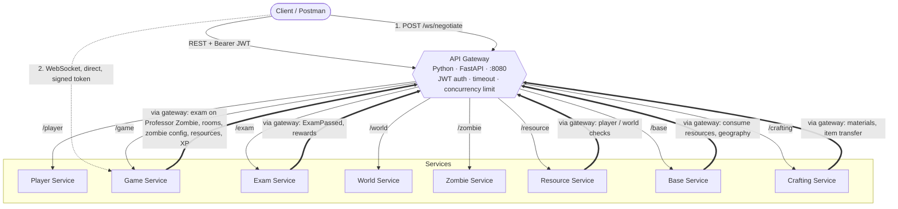

# In Kahoots with the Undead
 
**Course:** FAF.PAD21.1 — Autumn 2026
**Topic:** Topic 1 — Survive university exam season during a zombie apocalypse
**Team:** 6
 
| Name | Email | GitHub handle | Role focus |
|---|---|---|---|
| Mitu Vladlen | vladlen.mitu@gmail.com | _mituvladlen_ | Resource Service + Base Service |
| Moraru Gabriel | gabrielmoraru00@gmail.com | @Gabriel120405 | Crafting Service + Player Service |
| Mihai Mustea | mihaimustea121@gmail.com | @MihaiM1209 | World Service + Zombie Service |
| Alexandru Bujor | alexandru.bujor@isa.utm.md | @alexandru-bujor | Game Service + Exam Service |
 
---
 
## 1. Overview
 
Players wake up in FAF Cab and must survive the semester: gathering resources,
expanding their base, clearing zombies, and still passing exams administered
by Professor Zombies. The system is split into 8 microservices, each owning
a distinct slice of state and behavior.
 
## 2. Service Boundaries
 
| Service | Owns | Does NOT own |
|---|---|---|
| **Player Service** | Identity, auth, profiles, friends, presence, XP/levels, inventory (items), trading | Gameplay session state, map, resources |
| **Game Service** | Real-time sessions/lobbies, day/night cycle, timers, timed player actions, short-lived zombie behavior during a cycle | Persistent map, player inventory, resource quantities |
| **Exam Service** | Active exams, attempts, questions, answers, grades, pass/fail, course/achievement progression | Map unlocking itself (only notifies) |
| **World Service** | Campus map: rooms, corridors, zones, resource nodes, barricades, spawn configs | Base customizations, resource quantities |
| **Zombie Service** | Zombie type definitions, stats, behavior config, sprites, abilities | Runtime zombie instances during a session (that's Game Service) |
| **Resource Service** | Resource economy: quantities, location, idempotent gather/consume operations | Physical map, base state |
| **Base Service** | Player-built state: upgrades, barricades, facilities, storage, Kiki interactions | Campus geography (World Service owns that) |
| **Crafting Service** | Recipes, crafting validation, atomic craft operations | Player inventory storage (delegates the actual item transfer to Player Service) |
 
## 3. Architecture Diagram

From Lab 2 the **API Gateway** is the single entry point. Clients and services send every REST request to it; it validates the caller (JWT for clients, `X-Internal-Key` for services), applies its limits and forwards the request without the credentials. The only traffic that bypasses it is the live WebSocket to Game, which the gateway negotiates and the client then opens directly.


```mermaid
graph TD
    Client([Client / Postman])
    Gateway{{API Gateway<br/>Python · FastAPI · :8080<br/>JWT auth · timeout · concurrency limit}}

    subgraph Services
        Player[Player Service]
        Game[Game Service]
        Exam[Exam Service]
        World[World Service]
        Zombie[Zombie Service]
        Resource[Resource Service]
        Base[Base Service]
        Crafting[Crafting Service]
    end

    Client -->|REST + Bearer JWT| Gateway
    Client -->|1. POST /ws/negotiate| Gateway
    Client -.->|2. WebSocket, direct, signed token| Game

    Gateway -->|/game| Game
    Gateway -->|/exam| Exam
    Gateway -->|/world| World
    Gateway -->|/zombie| Zombie
    Gateway -->|/resource| Resource
    Gateway -->|/base| Base
    Gateway -->|/crafting| Crafting
    Gateway -->|/player| Player

    Game ==>|via gateway: exam on Professor Zombie, rooms, zombie config, resources, XP| Gateway
    Exam ==>|via gateway: ExamPassed, rewards| Gateway
    Crafting ==>|via gateway: materials, item transfer| Gateway
    Resource ==>|via gateway: player / world checks| Gateway
    Base ==>|via gateway: consume resources, geography| Gateway
```

Logical dependencies between the services (every arrow below is now a call **through the gateway**, e.g. Game calls `http://gateway:8081/exam/exams`):

| From | To | Why |
|---|---|---|
| Game | Exam | Start an exam on a Professor Zombie encounter |
| Game | World | Rooms, resource nodes, spawn points |
| Game | Zombie | Zombie types for the cycle |
| Game | Resource | Gather / steal resources |
| Game | Player | Validate players, change XP |
| Exam | World | `ExamPassed` unlocks a new wing |
| Exam | Player | Achievements and rewards |
| Base | Resource | Consume resources for upgrades |
| Base | World | References geography |
| Crafting | Resource | Validate required materials |
| Crafting | Player | Transfer the crafted item |

## 4. Technologies & Communication Patterns
 
> _To complete: team decision on the 2 languages._ Each service's language, framework, and
> communication style (REST/gRPC/messaging), with a short justification
> tying the choice to the service's needs (e.g. real-time Game Service →
> WebSockets; Exam Service → simple synchronous REST).
 
| Service | Language | Framework | Communication | Why |
|---|---|---|---|---|
| **API Gateway** | Python 3.12 | FastAPI + httpx + PyJWT | REST (+ WebSocket negotiation) | Written in the lab's required language. Async I/O suits a proxy that mostly waits on other services; FastAPI gives OpenAPI docs for free. |
| Player Service | TypeScript 5 | Node.js 22 + Express 5, PostgreSQL 16 | REST only, behind the gateway (issues the login JWT; reads the caller from `X-User-Id`) | Many small request/response calls from Game, Exam, Resource, Base and Crafting. Trades must move items between two players atomically: one PostgreSQL transaction locks both inventories, checks ownership and swaps. Same language as Resource and Base, so the team shares tooling. |
| Game Service | Go 1.22 | net/http (standard library) + gorilla/websocket, PostgreSQL 16 | WebSockets (direct, negotiated by the gateway) + REST | Many concurrent timers and live connections; goroutines keep them cheap. WebSockets push action progress, cycle changes and zombie events. |
| Exam Service | Go 1.22 | net/http (standard library), PostgreSQL 16 | REST | Simple request/response; transactions keep grades and achievements consistent. |
| World Service | TypeScript 5 | Node.js 22 + Express 4, MongoDB 7 | REST | The campus map is read-heavy and document-shaped (rooms, nodes, spawn configs with nested fields), so MongoDB fits without joins. TypeScript types keep the map models consistent. |
| Zombie Service | JavaScript (ES2022) | Node.js 22 + Express 4, MongoDB 7 | REST | Small config-only service: each zombie type is one document with nested stats, behavior, sprite and abilities. Plain JavaScript keeps it light. |
| Resource Service | TypeScript 5 | Node.js 22 + Express 5, PostgreSQL 16 | REST | Mostly I/O-bound database work. PostgreSQL transactions with `actionId` as primary key make gather/consume idempotent, so a retry after a reconnect never awards twice. Same language as Player Service. |
| Base Service | TypeScript 5 | Node.js 22 + Express 5, PostgreSQL 16 | REST | Simple request/response CRUD; transactions keep upgrades consistent. Pays for upgrades through Resource Service (idempotent consume, refund if the local save fails). Same language as Player Service. |
| Crafting Service | TypeScript 5 | Node.js 22 + Express 5, PostgreSQL 16 | REST only, behind the gateway (calls Player, Resource, Exam, World through it) | Orchestrates Resource (consume) and Player (deliver item), so it is mostly I/O waiting on other services, which Node handles well. Recipes have nested ingredients and unlock conditions (JSONB). The craft is a short saga keyed by `craftId`: idempotent consume, idempotent grant, refund on failure. |
 
## 5. Communication Contract
 
### 5.1 Data management
- **Database per service.** Every service owns its own database; no service reads another service's database directly.
- **Access through APIs only.** Cross-service data is fetched through the REST endpoints below (and WebSockets for live Game updates).
- **Event notifications.** State changes other services care about (e.g. `ExamPassed`) are sent as HTTP POST notifications to the owning service (to be replaced by a message broker in later labs if required).
- **Idempotency.** Requests that award or consume something carry an id (`actionId`, `examId`) so retries never apply twice.
- **Format.** JSON, UTF-8, ids are UUID strings, timestamps are ISO 8601 (UTC). Errors use `{ "error": "CODE", "message": "text" }`.
- **Through the gateway (Lab 2).** Services call each other at `http://gateway:8081/<service>/...` (internal listener), never directly. See 5.0.

### 5.0 API Gateway (owner: Alexandru Bujor) — port 8080

Every REST call goes through the gateway: clients use `http://localhost:8080/<service>/<path>`, services use the internal listener `http://gateway:8081/<service>/<path>`. The gateway forwards it to `<service>/<path>`: `GET /game/sessions` → Game `GET /sessions`.

| Prefix | Service |
|---|---|
| `/game` | Game Service (3001) |
| `/exam` | Exam Service (3002) |
| `/world` | World Service (3011) |
| `/zombie` | Zombie Service (3012) |
| `/resource` | Resource Service |
| `/base` | Base Service |
| `/crafting` | Crafting Service |
| `/player` | Player Service |

| Method | Path | Request body | Success response |
|---|---|---|---|
| GET | `/health` | – | `200 { "status": "ok", "service": "gateway", "version" }` |
| GET | `/health/services` | – | `200 { "gateway": "up", "services": { "game": "up", ... } }` |
| POST | `/auth/token` | `{ "playerId", "role": "player" \| "admin", "adminKey"? }` | `200 { "accessToken", "tokenType": "Bearer", "expiresIn" }` |
| POST | `/ws/negotiate` | `{ "sessionId", "playerId"? }` | `200 { "wsUrl", "expiresAt", "expiresIn" }` |
| any | `/<service>/<path>` | forwarded as is | the service's response |

**Authorization (at the gateway only).**
- Clients send `Authorization: Bearer <JWT>`: either a gateway token (`POST /auth/token`; HS256, claims `sub` = player id, `role`, `iss`, `exp`) or a Player Service token (`POST /player/auth/login`, checked with `PLAYER_JWT_SECRET`, role `player`). Services call each other through the internal listener `http://gateway:8081/<service>` (Docker network only, trusted as role `service`); Game and Exam also send `X-Internal-Key: <INTERNAL_API_KEY>`.
- `POST /player/auth/login` and `POST /player/auth/register` are public (no token needed).
- The gateway **removes** `Authorization`, `X-Internal-Key` and any client-sent `X-User-Id`/`X-User-Role`, and adds `X-User-Id`, `X-User-Role` (`player`, `admin`, `service`), `X-Request-Id`, `X-Forwarded-For`, `X-Forwarded-Prefix`. Services never validate tokens.
- Admin-only: `POST`/`DELETE /exam/courses...`, `DELETE /game/sessions/{id}`.

**WebSocket negotiation.** `POST /ws/negotiate` checks the token and that the player is in the Game session, then returns `ws://localhost:3001/ws?sessionId=…&playerId=…&token=…`. The client connects to Game directly; Game verifies the token with the shared `WS_TOKEN_SECRET` (`base64url({"sid","pid","exp"}).base64url(HMAC-SHA256)`, valid 60 s).

**Limits.** Every service and the gateway have a request timeout and a concurrent request limit.

| Where | Timeout | Too many requests | Downstream down |
|---|---|---|---|
| Gateway | **504** `GATEWAY_TIMEOUT` | **429** `TOO_MANY_REQUESTS` + `Retry-After` | **502** `BAD_GATEWAY` |
| Game, Exam, World, Zombie | **408** `REQUEST_TIMEOUT` | **429** `TOO_MANY_REQUESTS` + `Retry-After` | **502** `UPSTREAM_ERROR` |

**Gateway errors:** `MISSING_TOKEN`, `INVALID_TOKEN`, `TOKEN_EXPIRED`, `INVALID_INTERNAL_KEY` (401); `FORBIDDEN` (403); `SERVICE_NOT_FOUND` (404); `PLAYER_NOT_IN_SESSION` (409); `INVALID_BODY`, `INVALID_ROLE` (400); `TOO_MANY_REQUESTS` (429); `BAD_GATEWAY` (502); `GATEWAY_TIMEOUT` (504).

### 5.2 Game Service (owner: Alexandru Bujor) — port 3001
 
| Method | Path | Request body | Success response |
|---|---|---|---|
| GET | `/health` | – | `200 { "status": "ok" }` |
| POST | `/sessions` | `{ "name": "string", "maxPlayers": 4 }` | `201 Session` |
| GET | `/sessions` | – | `200 Session[]` |
| GET | `/sessions/{sessionId}` | – | `200 Session` |
| POST | `/sessions/{sessionId}/join` | `{ "playerId": "uuid" }` | `200 Session` |
| POST | `/sessions/{sessionId}/leave` | `{ "playerId": "uuid" }` | `200 Session` |
| DELETE | `/sessions/{sessionId}` | – | `204` |
| GET | `/sessions/{sessionId}/cycle` | – | `200 { "phase": "day" \| "night", "cycleNumber": 3, "endsAt": "ISO" }` |
| POST | `/sessions/{sessionId}/actions` | `{ "playerId": "uuid", "type": "ActionType", "targetId": "uuid" }` | `202 Action` |
| GET | `/sessions/{sessionId}/actions/{actionId}` | – | `200 Action` |
| DELETE | `/sessions/{sessionId}/actions/{actionId}` | – | `200 Action` (status `cancelled`) |
| POST | `/sessions/{sessionId}/encounters` | `{ "playerId": "uuid", "zombieId": "uuid" }` | `201 Encounter` |
 
```json
// Session
{ "sessionId": "uuid", "name": "FAF Cab Survivors", "status": "waiting | active | finished",
  "maxPlayers": 4, "players": ["uuid"], "createdAt": "ISO", "startedAt": "ISO | null" }
 
// ActionType: CHOP_BENCHES (600 s) | SCAVENGE_CANTEEN (300 s) | CLEAR_ROOM (180 s)
//             | BARRICADE_ROOM (240 s) | REPAIR_BASE (300 s)
// Action
{ "actionId": "uuid", "sessionId": "uuid", "playerId": "uuid", "type": "SCAVENGE_CANTEEN",
  "targetId": "uuid", "status": "in_progress | completed | cancelled",
  "startedAt": "ISO", "endsAt": "ISO", "durationSec": 300 }
 
// Encounter
{ "encounterId": "uuid", "sessionId": "uuid", "playerId": "uuid", "zombieId": "uuid",
  "zombieType": "PROFESSOR | TOURIST",
  "outcome": "EXAM_STARTED | RESOURCES_STOLEN | XP_STOLEN", "examId": "uuid | null", "createdAt": "ISO" }
```
 
**WebSocket** `ws://<host>:3001/ws?sessionId=<uuid>&playerId=<uuid>` — server pushes:
 
```json
{ "event": "ACTION_PROGRESS",  "data": { "actionId": "uuid", "progress": 0.45 } }
{ "event": "ACTION_COMPLETED", "data": { "actionId": "uuid", "playerId": "uuid", "type": "SCAVENGE_CANTEEN" } }
{ "event": "CYCLE_CHANGED",    "data": { "phase": "night", "cycleNumber": 4 } }
{ "event": "ZOMBIE_SPAWNED",   "data": { "zombieId": "uuid", "zombieType": "TOURIST", "roomId": "uuid" } }
{ "event": "ZOMBIE_ATTACK",    "data": { "zombieId": "uuid", "playerId": "uuid", "outcome": "XP_STOLEN" } }
```
 
#### Lab 1 updates
- **Session** also returns `startedAt`, the time the first player joined, which is when the day/night cycle starts.
- **Encounter** also returns `sessionId`, `playerId`, `zombieId` and `createdAt`.
- **Encounter request:** `zombieId` is the id of a zombie type in Zombie Service (`zombieTypeId`).
- **Encounter rules:** a `PROFESSOR` zombie starts an exam (`EXAM_STARTED`). A `TOURIST` zombie steals 10 XP by day (`XP_STOLEN`) and 5 resources by night (`RESOURCES_STOLEN`).
- **WebSocket:** `ACTION_COMPLETED` data also includes `playerId`.
- **Error codes:** `VALIDATION_ERROR`, `INVALID_JSON`, `INVALID_ACTION_TYPE` (400); `SESSION_NOT_FOUND`, `ACTION_NOT_FOUND`, `PLAYER_NOT_FOUND`, `ZOMBIE_NOT_FOUND` (404); `SESSION_FULL`, `SESSION_FINISHED`, `SESSION_NOT_ACTIVE`, `PLAYER_NOT_IN_SESSION`, `ACTION_IN_PROGRESS`, `ACTION_NOT_IN_PROGRESS`, `ROOM_NOT_AVAILABLE` (409); `UPSTREAM_ERROR` (502).
#### Lab 2 updates
- Reached through the gateway at `/game/...`. Port 3001 stays published only for the direct WebSocket.
- **WebSocket:** `ws://localhost:3001/ws?sessionId=&playerId=&token=`. Get the URL from the gateway's `POST /ws/negotiate`. Without a valid token Game answers **401** `INVALID_WS_TOKEN`.
- **Limits:** **408** `REQUEST_TIMEOUT` after `REQUEST_TIMEOUT_MS` (5000), **429** `TOO_MANY_REQUESTS` above `MAX_CONCURRENT_REQUESTS` (50). With `DEMO_MODE=true`: `GET /debug/slow?ms=N`.
- Outgoing calls use `http://gateway:8081/<service>` (internal listener) and also send `X-Internal-Key`. World rooms (`{id}`) and Zombie types (`{id, code}`) are read in their real shape.

**Calls Game Service makes to other services** (through the gateway from Lab 2):
 
| Target | Call | Expected response |
|---|---|---|
| World | `GET /rooms?available=true` | `200 [ { "roomId", "name", "available" } ]` |
| World | `GET /spawn-points` | `200 [ { "spawnPointId", "roomId" } ]` |
| Zombie | `GET /zombie-types` | `200 [ { "zombieTypeId", "name", "kind": "PROFESSOR \| TOURIST" } ]` |
| Resource | `POST /resources/gather { playerId, nodeId, actionId, actionType }` | 2xx, idempotent by `actionId` |
| Resource | `POST /resources/steal { playerId, encounterId, amount }` | 2xx, idempotent by `encounterId` |
| Player | `GET /players/{playerId}` | 200 = exists, 404 = not found |
| Player | `PATCH /players/{playerId}/xp { delta }` | 2xx |
| Exam | `POST /exams { playerId, sessionId, zombieId }` | `201 { "examId", ... }` |
 
### 5.3 Exam Service (owner: Alexandru Bujor) — port 3002
 
| Method | Path | Request body | Success response |
|---|---|---|---|
| GET | `/health` | – | `200 { "status": "ok" }` |
| GET | `/courses` | – | `200 Course[]` |
| POST | `/courses` | `{ "name": "Linear Algebra", "category": "MATH" }` | `201 Course` |
| GET | `/courses/{courseId}` | – | `200 Course` |
| DELETE | `/courses/{courseId}` | – | `204` |
| GET | `/courses/{courseId}/questions` | – | `200 Question[]` (with `correctOption`, admin use) |
| POST | `/courses/{courseId}/questions` | `{ "text": "string", "options": ["a","b","c","d"], "correctOption": 2 }` | `201 Question` |
| POST | `/exams` | `{ "playerId": "uuid", "courseId": "uuid (optional)", "sessionId": "uuid", "zombieId": "uuid" }` | `201 Exam` |
| GET | `/exams/{examId}` | – | `200 Exam` |
| POST | `/exams/{examId}/submit` | `{ "answers": [ { "questionId": "uuid", "selectedOption": 1 } ] }` | `200 ExamResult` |
| DELETE | `/exams/{examId}` | – | `200 Exam` (status `abandoned`) |
| GET | `/players/{playerId}/exams?status=in_progress` | – | `200 Exam[]` |
| GET | `/players/{playerId}/progress` | – | `200 Progress` |
| GET | `/players/{playerId}/achievements` | – | `200 Achievement[]` |
 
```json
// Course
{ "courseId": "uuid", "name": "Linear Algebra", "category": "MATH | PROGRAMMING | NETWORKS | HUMANITIES",
  "questionCount": 5, "createdAt": "ISO" }
 
// Exam  (correct answers are never sent to the player; grade appears once passed or failed)
{ "examId": "uuid", "playerId": "uuid", "courseId": "uuid",
  "status": "in_progress | passed | failed | abandoned", "attemptNumber": 1,
  "questions": [ { "questionId": "uuid", "text": "string", "options": ["a","b","c","d"] } ],
  "grade": 8, "createdAt": "ISO", "expiresAt": "ISO" }
 
// ExamResult  (grade on the 1-10 scale, pass mark 5)
{ "examId": "uuid", "score": 4, "total": 5, "grade": 8, "passed": true, "attemptNumber": 1,
  "unlockedAchievements": [ { "code": "SURVIVED_THE_PUMPKIN", "name": "Survived the Pumpkin" } ] }
 
// Progress
{ "playerId": "uuid", "coursesPassed": 3, "coursesTotal": 8, "averageGrade": 7.7,
  "grades": [ { "courseId": "uuid", "grade": 8 } ], "diplomaProgress": 0.375 }
 
// Achievement
{ "code": "SURVIVED_THE_PUMPKIN", "name": "Survived the Pumpkin", "unlockedAt": "ISO" }
```
 
**Notifications Exam Service sends:**
 
| Target | Call | When |
|---|---|---|
| World | `POST /events/exam-passed { playerId, courseId, category, grade }` | An exam is passed (World may unlock a wing) |
| Player | `POST /players/{playerId}/rewards { source: "ACHIEVEMENT", code, xp }` | An achievement is unlocked |
 
#### Lab 1 updates
- **`POST /exams`:** `courseId` is optional. Without it, the first course (by name) the player hasn't passed is chosen.
- **`correctOption` / `selectedOption`** are 0-based indexes into `options`.
- **Exam** also returns `grade` once it is `passed` or `failed`. An exam submitted after `expiresAt` fails with grade 1.
- **Course** also returns `createdAt`. `DELETE /courses/{id}` returns `409 COURSE_HAS_EXAMS` if players already took that course.
- **Grading:** `grade = 1 + 9 × score / total`, rounded down. The pass mark is 5.
- **Error codes:** `VALIDATION_ERROR`, `INVALID_JSON`, `INVALID_ANSWER` (400); `COURSE_NOT_FOUND`, `EXAM_NOT_FOUND`, `PLAYER_NOT_FOUND` (404); `COURSE_ALREADY_PASSED`, `COURSE_HAS_NO_QUESTIONS`, `NO_COURSE_AVAILABLE`, `EXAM_IN_PROGRESS`, `EXAM_NOT_IN_PROGRESS`, `EXAM_EXPIRED`, `COURSE_HAS_EXAMS` (409); `UPSTREAM_ERROR` (502).
| Achievement | Name | Rule | XP |
|---|---|---|---|
| `SURVIVED_THE_PUMPKIN` | Survived the Pumpkin | First course passed | 50 |
| `TEACHERS_PET` | Teacher's Pet | Grade 10 | 100 |
| `RETAKE_WARRIOR` | Retake Warrior | Passed on attempt 2 or later | 30 |
| `HAT_TRICK` | Hat Trick | 3 courses passed | 150 |
| `DIPLOMA_SECURED` | Diploma Secured | Every course passed | 500 |
 
#### Lab 2 updates
- Reached only through the gateway at `/exam/...` (no published port). `POST`/`DELETE /exam/courses...` need an admin token.
- **Limits:** **408** `REQUEST_TIMEOUT` after `REQUEST_TIMEOUT_MS` (5000), **429** `TOO_MANY_REQUESTS` above `MAX_CONCURRENT_REQUESTS` (50). With `DEMO_MODE=true`: `GET /debug/slow?ms=N`.
- Outgoing calls (World `ExamPassed`, Player rewards) use `http://gateway:8081/<service>` (internal listener) and also send `X-Internal-Key`.

### 5.4 Resource Service (owner: Mitu Vladlen) — port 3005
 
| Method | Path | Request body | Success response |
|---|---|---|---|
| GET | `/health` | – | `200 { "status": "ok", "service": "resource-service" }` |
| GET | `/resource-types` | – | `200 ResourceType[]` |
| POST | `/resource-types` | `{ "id": "gold", "name": "Gold", "description": "string (optional)" }` | `201 ResourceType` |
| GET | `/resource-types/{id}` | – | `200 ResourceType` |
| PUT | `/resource-types/{id}` | `{ "name": "Gold", "description": "string (optional)" }` | `200 ResourceType` |
| DELETE | `/resource-types/{id}` | – | `204` |
| GET | `/players/{playerId}/resources` | – | `200 { "playerId": "uuid", "items": InventoryItem[] }` |
| GET | `/players/{playerId}/resources/{resourceTypeId}` | – | `200 InventoryItem` |
| PUT | `/players/{playerId}/resources/{resourceTypeId}` | `{ "quantity": 100 }` (admin / testing) | `200 InventoryItem` |
| DELETE | `/players/{playerId}/resources` | – (admin / testing) | `204` |
| POST | `/resources/gather` | `{ "actionId": "uuid", "playerId": "uuid", "nodeId": "uuid", "amount": 5 }` | `201 ActionResult` (`200` if duplicate) |
| POST | `/resources/consume` | `{ "actionId": "uuid", "playerId": "uuid", "items": [ { "resourceTypeId": "wood", "amount": 20 } ], "reason": "string (optional)" }` | `201 ActionResult` (`200` if duplicate) |
| POST | `/resources/grant` | `{ "actionId": "uuid", "playerId": "uuid", "items": [ { "resourceTypeId": "food", "amount": 3 } ], "source": "kiki" }` | `201 ActionResult` (`200` if duplicate) |
| GET | `/resources/actions/{actionId}` | – | `200 ResourceAction` |
| GET | `/players/{playerId}/gathers` | – | `200 ResourceAction[]` (where the player gathered) |
| GET | `/nodes/{nodeId}/gathers` | – | `200 { "nodeId": "uuid", "totals": [ { "playerId", "resourceTypeId", "amount" } ], "actions": ResourceAction[] }` |
 
```json
// ResourceType  (seeded: wood, metal_scraps, paper, food)
{ "id": "wood", "name": "Wood", "description": "Basic building material" }
 
// InventoryItem  (every resource type is listed, 0 if the player has none)
{ "playerId": "uuid", "resourceTypeId": "wood", "quantity": 50 }
 
// ResourceAction  (every change to an inventory; actionId is the idempotency key)
{ "actionId": "uuid", "kind": "gather | consume | grant", "playerId": "uuid",
  "nodeId": "uuid | null", "source": "string | null",
  "items": [ { "resourceTypeId": "wood", "amount": 5 } ], "createdAt": "ISO" }
 
// ActionResult
{ "action": ResourceAction, "duplicate": false, "inventory": InventoryItem[] }
```
 
#### Lab 1 notes
- **Idempotency:** `actionId` is the primary key of the actions table. The first request returns `201`; repeating the same `actionId` returns `200` with `"duplicate": true` and changes nothing. Reusing an `actionId` for another player or operation returns `409 ACTION_ID_REUSED`.
- **Gather:** the resource type comes from the World node (`nodeId`), so the client never chooses what it receives.
- **Consume is all-or-nothing:** it runs in one DB transaction with the inventory rows locked. If any item is short, nothing changes and the response is `409 INSUFFICIENT_RESOURCES` with `details: [ { "resourceTypeId", "required", "available" } ]`. A rejected `actionId` is not used up and can be retried.
- **Grant** is used for rewards (Kiki in Base Service) and for refunds (`<actionId>:refund`).
- **Error codes:** `VALIDATION_ERROR`, `INVALID_JSON` (400); `NOT_FOUND` (404: player, node, resource type, action); `RESOURCE_TYPE_EXISTS`, `ACTION_ID_REUSED`, `INSUFFICIENT_RESOURCES` (409); `UPSTREAM_ERROR` (502).
**Calls Resource Service makes to other services** (mocked in Lab 1, to confirm with each owner):
 
| Target | Call | Expected response |
|---|---|---|
| Player | `GET /players/{playerId}` | 200 = exists, 404 = not found |
| World | `GET /nodes/{nodeId}` | `200 { "id": "uuid", "resourceTypeId": "wood" }`, 404 = not found |
 
### 5.5 Base Service (owner: Mitu Vladlen) — port 3006

#### Lab 2 updates
- Reached only through the gateway at `/base/...` (no published port). `/health` also returns `"version": "2.0.0"`.
- **Limits:** **408** `REQUEST_TIMEOUT` after `REQUEST_TIMEOUT_MS` (5000), **429** `TOO_MANY_REQUESTS` (+ `Retry-After`) above `MAX_CONCURRENT_REQUESTS` (50). With `DEMO_MODE=true`: `GET /debug/slow?ms=N`.
- Outgoing calls (Resource `consume`, Player, World) use `http://gateway:8081/<service>` (internal listener), send `X-Internal-Key` and give up after `UPSTREAM_TIMEOUT_MS` (3000) with **504** `UPSTREAM_TIMEOUT`.
- GitHub Actions test every PR and push `mituvladlen/base-service:2.0.0` and `:latest` on merge to `main`.
 
| Method | Path | Request body | Success response |
|---|---|---|---|
| GET | `/health` | – | `200 { "status": "ok", "service": "base-service", "version" }` |
| GET | `/costs` | – | `200` upgrade, barricade and facility costs + Kiki reward table |
| GET | `/bases` | – | `200 Base[]` |
| POST | `/bases` | `{ "playerId": "uuid", "name": "string (optional)" }` | `201 Base` (level 1 "FAF Cab") |
| GET | `/bases/{playerId}` | – | `200 BaseDetails` |
| PATCH | `/bases/{playerId}` | `{ "name": "FAF Cab Deluxe" }` | `200 Base` |
| DELETE | `/bases/{playerId}` | – | `204` |
| GET | `/bases/{playerId}/upgrade` | – | `200 { "currentLevel": 1, "maxLevel": 5, "nextLevel": 2, "cost": ResourceAmount[], "nextStorageCapacity": 150 }` |
| POST | `/bases/{playerId}/upgrade` | `{ "actionId": "uuid" }` | `200 ActionOutcome<Base>` |
| GET | `/bases/{playerId}/barricades` | – | `200 Barricade[]` |
| POST | `/bases/{playerId}/barricades` | `{ "actionId": "uuid", "roomId": "uuid" }` | `201 ActionOutcome<Barricade>` (`200` if duplicate) |
| DELETE | `/bases/{playerId}/barricades/{barricadeId}` | – | `204` |
| GET | `/bases/{playerId}/facilities` | – | `200 Facility[]` |
| POST | `/bases/{playerId}/facilities` | `{ "actionId": "uuid", "type": "workbench \| kitchen \| library \| generator" }` | `201 ActionOutcome<Facility>` (`200` if duplicate) |
| DELETE | `/bases/{playerId}/facilities/{facilityId}` | – | `204` |
| GET | `/bases/{playerId}/decorations` | – | `200 Decoration[]` |
| POST | `/bases/{playerId}/decorations` | `{ "name": "Plant" }` | `201 Decoration` |
| DELETE | `/bases/{playerId}/decorations/{decorationId}` | – | `204` |
| GET | `/bases/{playerId}/kiki` | – | `200 KikiInteraction[]` |
| POST | `/bases/{playerId}/kiki` | `{ "actionId": "uuid" }` | `201 ActionOutcome<KikiInteraction>` (`200` if duplicate) |
 
```json
// Base  (storageCapacity = 100 + 50 × (level − 1))
{ "playerId": "uuid", "name": "FAF Cab", "level": 1, "storageCapacity": 100,
  "createdAt": "ISO", "updatedAt": "ISO" }
 
// BaseDetails
{ ...Base, "barricades": Barricade[], "facilities": Facility[], "decorations": Decoration[] }
 
// Barricade
{ "id": "uuid", "playerId": "uuid", "roomId": "uuid", "strength": 10, "createdAt": "ISO" }
 
// Facility
{ "id": "uuid", "playerId": "uuid", "type": "workbench", "level": 1, "createdAt": "ISO" }
 
// Decoration
{ "id": "uuid", "playerId": "uuid", "name": "Plant", "createdAt": "ISO" }
 
// KikiInteraction  (reward is null when Kiki brings nothing)
{ "actionId": "uuid", "playerId": "uuid", "reward": { "resourceTypeId": "food", "amount": 3 },
  "message": "Kiki brought you some snacks!", "createdAt": "ISO" }
 
// ActionOutcome<T>
{ "actionId": "uuid", "duplicate": false, "cost": [ { "resourceTypeId": "wood", "amount": 20 } ], "result": T }
```
 
| Operation | Cost |
|---|---|
| Upgrade level L → L+1 (max level 5) | wood 20·L, metal_scraps 10·L, paper 5·L |
| Barricade (one per room) | wood 10, metal_scraps 5 |
| Facility `workbench` / `kitchen` / `library` / `generator` | wood 15 + metal_scraps 5 / wood 10 + food 5 / paper 20 + wood 5 / metal_scraps 15 + wood 5 |
| Decoration (max 20) | free |
| Kiki | free; random reward: food 1–5 (30%), paper 1–4 (25%), wood 2–6 (20%), metal_scraps 1–3 (10%), nothing (15%) |
 
#### Lab 1 notes
- **Idempotency:** upgrade, barricade, facility and Kiki take an `actionId`. Repeating it returns the stored result with `"duplicate": true` and never charges or rewards twice.
- **Paying:** Base Service charges through Resource Service (`POST /resources/consume` with the same `actionId`), then saves locally in a transaction. If the local save fails after paying (e.g. two upgrades race and the level changed), it refunds with `POST /resources/grant` and `actionId = <actionId>:refund`.
- **Kiki** rewards are granted through `POST /resources/grant` with `source: "kiki"`.
- **Error codes:** `VALIDATION_ERROR`, `INVALID_JSON` (400); `NOT_FOUND` (404: player, base, room, barricade, facility, decoration); `BASE_EXISTS`, `MAX_LEVEL_REACHED`, `BASE_CHANGED`, `ROOM_ALREADY_BARRICADED`, `FACILITY_EXISTS`, `DECORATION_LIMIT`, `INSUFFICIENT_RESOURCES`, `ACTION_ID_REUSED` (409); `UPSTREAM_ERROR` (502).
**Calls Base Service makes to other services** (Player and World mocked in Lab 1; Resource is a real call):
 
| Target | Call | Expected response |
|---|---|---|
| Player | `GET /players/{playerId}` | 200 = exists, 404 = not found |
| World | `GET /rooms/{roomId}` | 200 = exists, 404 = not found |
| Resource | `POST /resources/consume { actionId, playerId, items, reason }` | `201`/`200`, `409 INSUFFICIENT_RESOURCES` |
| Resource | `POST /resources/grant { actionId, playerId, items, source }` | `201`/`200` |
 
### 5.6 World Service (owner: Mihai Mustea) — port 3011

Bodies are JSON. Errors use `{ "error": "CODE", "message": "text" }` (`VALIDATION_ERROR` 400, `NOT_FOUND` 404, `REQUEST_TIMEOUT` 408, `EXAM_NOT_VERIFIED` 422, `TOO_MANY_REQUESTS` 429, `INTERNAL_ERROR` 500, `UPSTREAM_ERROR` 502).

#### Health

| Method | Path | Response |
|---|---|---|
| `GET` | `/health` | `200 { "status": "ok", "service": "world-service" }` |

#### CRUD resources

Every resource below supports the same five operations:

| Method | Path | Request | Response |
|---|---|---|---|
| `GET` | `/<resource>` | optional query filters | `200 [ ... ]` |
| `GET` | `/<resource>/{id}` | - | `200 {...}`, `404` |
| `POST` | `/<resource>` | full body | `201 {...}`, `400` |
| `PUT` | `/<resource>/{id}` | full body | `200 {...}`, `400`, `404` |
| `PATCH` | `/<resource>/{id}` | partial body | `200 {...}`, `400`, `404` |
| `DELETE` | `/<resource>/{id}` | - | `204`, `404` |

| Resource | Body fields | Query filters |
|---|---|---|
| `/rooms` | `name`, `type` (`base` `canteen` `library` `laboratory` `classroom` `corridor_hub` `other`), `wingId?`, `zoneId?`, `description?` | `type`, `wingId`, `available=true` |
| `/corridors` | `fromRoomId`, `toRoomId`, `locked?` | `fromRoomId`, `toRoomId` |
| `/zones` | `name`, `description?`, `dangerLevel` (0-10) | - |
| `/resource-nodes` | `roomId`, `resourceType` (`metal_scraps` `paper` `food` `textbooks`), `quantity`, `respawnSeconds?` | `roomId`, `resourceType`, `available=true` |
| `/barricades` | `roomId`, `health`, `maxHealth` | `roomId` |
| `/spawn-configs` | `roomId`, `zombieType` (`code` from Zombie Service, e.g. `PROFESSOR`), `maxZombies`, `intervalSeconds`, `active?` | `roomId`, `zombieType` |
| `/wings` | `name`, `unlocked?`, `requiredCourseId?` | - |

#### Map queries and actions

| Method | Path | Request | Response |
|---|---|---|---|
| `GET` | `/rooms?available=true` | - | `200 [rooms]` not in a locked wing |
| `GET` | `/rooms/{id}/resource-nodes` | - | `200 [nodes]`, `404` |
| `GET` | `/resource-nodes?available=true` | - | `200 [nodes]` with quantity > 0 in available rooms |
| `GET` | `/spawn-points` | - | `200 [spawnConfigs]` active, in available rooms |
| `POST` | `/wings/{id}/unlock` | - | `200 { "wing": {...}, "alreadyUnlocked": false }`, `404` |
| `POST` | `/events/exam-passed` | `{ "playerId": "uuid", "courseId": "uuid", "category": "MIDTERM", "grade": 8.5 }` | `200 { "unlocked": [wing], "alreadyUnlocked": [wing] }` (empty lists when no wing needs that course), `400`, `422` |

`POST /events/exam-passed` is sent by the Exam Service (payload as agreed in the contract). Every wing whose `requiredCourseId` equals the `courseId` is unlocked; repeats are idempotent. World checks the event with the Exam Service behind `ExamServiceClient` (`src/clients/examClient.ts`): a mock in Lab 1, a real HTTP client through the gateway from Lab 2.

#### Lab 1 notes
- **Storage:** MongoDB (`world` database), seeded by `db-scripts/world-service/seed.js` (FAF Cab, Canteen, Library, Laboratory, 2 classrooms, 1 locked wing).
- **Available rooms:** a room is available when it has no wing or its wing is unlocked. Resource nodes and spawn points follow the same rule.
- **Resource types:** Laboratory = `metal_scraps`, Library = `paper`, Canteen = `food`, Classrooms = `textbooks`.
- **Unlocking:** a wing has an optional `requiredCourseId`. `POST /events/exam-passed` unlocks every wing whose `requiredCourseId` equals the `courseId`, and is idempotent.
- **Spawn configs** reference a zombie type by its Zombie Service `code` (e.g. `PROFESSOR`).

#### Lab 2 updates
- Reached only through the gateway at `/world/...` (no published port).
- **Limits:** **408** `REQUEST_TIMEOUT` after `REQUEST_TIMEOUT_MS` (5000), **429** `TOO_MANY_REQUESTS` above `MAX_CONCURRENT_REQUESTS` (50). With `DEMO_MODE=true`: `GET /debug/slow?ms=N`.
- **`ExamPassed` is verified:** with `EXAM_SERVICE_URL=http://gateway:8081/exam`, World calls Exam `GET /players/{playerId}/progress` (also sending `X-Internal-Key`) and unlocks only if `courseId` has a grade of 5 or more; otherwise **422** `EXAM_NOT_VERIFIED`. Exam saves the grade before it notifies World. Exam unreachable: **502** `UPSTREAM_ERROR`. Empty `EXAM_SERVICE_URL` = the Lab 1 mock.
- **Seed on start:** with `SEED_ON_START=true` (team compose) the campus map is inserted when the database is empty. The East Wing needs the Exam seed course PAD (`f0000000-0000-4000-8000-000000000002`), so passing that exam unlocks it.
- **Postman:** `world-service.postman_collection.json` has a folder *Lab 2: ExamPassed through the gateway*: a new player passes the PAD exam and the East Wing opens.

**Calls World Service makes to other services** (through the gateway from Lab 2):

| Target | Call | Expected response |
|---|---|---|
| Exam | `GET /players/{playerId}/progress` | `200 { "grades": [ { "courseId", "grade" } ] }`, 404 = unknown player (not verified) |

**Calls World Service receives from other services:**

| From | Call | When |
|---|---|---|
| Exam | `POST /events/exam-passed { playerId, courseId, category, grade }` | An exam is passed (mocked in Lab 1 behind `ExamServiceClient`) |
| Game | `GET /rooms?available=true`, `GET /rooms/{roomId}/resource-nodes`, `GET /spawn-points` | Where players can act, where zombies spawn |

### 5.7 Zombie Service (owner: Mihai Mustea) — port 3012

Bodies are JSON. Errors use `{ "error": "CODE", "message": "text" }`: `VALIDATION_ERROR` 400, `NOT_FOUND` 404, `CONFLICT` 409 (duplicate name or code), `INTERNAL_ERROR` 500.

| Method | Path | Request | Response |
|---|---|---|---|
| `GET` | `/health` | - | `200 { "status": "ok", "service": "zombie-service" }` |
| `GET` | `/zombie-types` | query `name`, `code`, `behaviorMode` (optional) | `200 [ zombieType ]` |
| `POST` | `/zombie-types` | full zombie type | `201 zombieType`, `400`, `409` |
| `GET` | `/zombie-types/{id}` | - | `200 zombieType`, `404` |
| `PUT` | `/zombie-types/{id}` | full zombie type | `200 zombieType`, `400`, `404`, `409` |
| `PATCH` | `/zombie-types/{id}` | partial zombie type | `200 zombieType`, `400`, `404` |
| `DELETE` | `/zombie-types/{id}` | - | `204`, `404` |
| `GET` | `/zombie-types/{id}/stats` | - | `200 stats`, `404` |
| `PATCH` | `/zombie-types/{id}/stats` | partial stats | `200 stats`, `400`, `404` |
| `GET` | `/zombie-types/{id}/behavior` | - | `200 behavior`, `404` |
| `PUT` | `/zombie-types/{id}/behavior` | behavior | `200 behavior`, `400`, `404` |
| `GET` | `/zombie-types/{id}/sprite` | - | `200 sprite`, `404` |
| `PUT` | `/zombie-types/{id}/sprite` | sprite | `200 sprite`, `400`, `404` |
| `GET` | `/zombie-types/{id}/abilities` | - | `200 [ ability ]`, `404` |
| `POST` | `/zombie-types/{id}/abilities` | ability | `201 ability`, `400`, `404`, `409` |
| `DELETE` | `/zombie-types/{id}/abilities/{name}` | - | `204`, `404` |

#### Lab 1 notes
- **Storage:** MongoDB (`zombie` database), seeded by `db-scripts/zombie-service/seed.js` with four types: `PROFESSOR`, `TOURIST`, `OVERWORKED_STUDENT`, `DEAN`.
- **Standalone:** Zombie Service calls no other service, so there is nothing to mock. It only stores definitions; live zombies belong to Game Service.
- **Uniqueness:** `code` and `name` are both unique (`409 CONFLICT`).

#### Lab 2 updates
- Reached only through the gateway at `/zombie/...` (no published port).
- **Limits:** **408** `REQUEST_TIMEOUT` after `REQUEST_TIMEOUT_MS` (5000), **429** `TOO_MANY_REQUESTS` above `MAX_CONCURRENT_REQUESTS` (50). With `DEMO_MODE=true`: `GET /debug/slow?ms=N`.
- Still standalone: Zombie calls no other service.
- **Seed on start:** with `SEED_ON_START=true` (team compose) the four types are inserted when the database is empty.

**Calls Zombie Service receives from other services:**

| From | Call | When |
|---|---|---|
| Game | `GET /zombie-types` | Zombie configs for the cycle |

### 5.8 Player Service (owner: Moraru Gabriel) — `/player` on the gateway (container port 3032)

JSON over HTTP, UTF-8. Ids are UUIDs, timestamps ISO 8601 (UTC).
Errors: `{ "error": "CODE", "message": "text", "details"?: [...] }`.

**Auth (Lab 2):** `POST /auth/login` returns a JWT, which the client sends to the **gateway** as `Authorization: Bearer <token>`.
The gateway validates it and forwards `X-User-Id` / `X-User-Role`; this service never sees the token.
Routes marked 🔒 need `X-User-Id` (else `401 UNAUTHORIZED`). The caller must be the player in the path (else `403 FORBIDDEN`),
unless `X-User-Role` is `service` or `admin`. Routes without 🔒 are also called by other services (Game, Exam, Crafting, Resource, Base).

#### Auth

| Method | Path | Request body | Response |
|---|---|---|---|
| GET | `/health` | – | `200 { "status": "ok", "service": "player-service", "storage": "postgres" }` (never limited) |
| GET | `/debug/slow?ms=N` | – | `200 { "sleptMs": N }`, only with `DEMO_MODE=true` |
| POST | `/auth/register` | `{ "username": "dave", "email": "dave@faf.utm.md", "password": "min 8 chars", "displayName"?: "Dave" }` | `201 { "player": Player, "token": "jwt" }`, `400`, `409 USERNAME_TAKEN / EMAIL_TAKEN` |
| POST | `/auth/login` | `{ "username": "alice or email", "password": "password123" }` | `200 { "player": Player, "token": "jwt" }` (sets presence `online`), `401 INVALID_CREDENTIALS` |
| POST | `/auth/logout` 🔒 | – | `204` (sets presence `offline`) |
| GET | `/auth/me` 🔒 | – | `200 Player` |

#### Players, presence, XP

| Method | Path | Request body | Response |
|---|---|---|---|
| GET | `/players` | query `presence=online\|offline\|in_game`, `q=<text>` (optional) | `200 Player[]` |
| GET | `/players/{playerId}` | – | `200 Player`, `404 PLAYER_NOT_FOUND` |
| PATCH | `/players/{playerId}` 🔒 | any of `{ "displayName", "bio", "avatarUrl" (or null), "email" }` | `200 Player`, `400`, `403`, `409 EMAIL_TAKEN` |
| DELETE | `/players/{playerId}` 🔒 | – | `204`, `403` |
| PUT | `/players/{playerId}/presence` 🔒 | `{ "status": "online \| offline \| in_game" }` | `200 { "playerId", "presence", "lastSeenAt" }` |
| PATCH | `/players/{playerId}/xp` | `{ "delta": 50 }` (negative allowed, XP never below 0) | `200 XpResult`, `400`, `404` |
| POST | `/players/{playerId}/rewards` | `{ "source": "ACHIEVEMENT", "code": "SURVIVED_THE_PUMPKIN", "xp": 50, "items"?: [ItemQuantity] }` | `201 XpResult + { "duplicate": false }`; `200` with `"duplicate": true` if this (source, code) was already given; `404 PLAYER_NOT_FOUND / ITEM_NOT_FOUND` |

```json
// Player
{ "playerId": "uuid", "username": "alice", "email": "alice@faf.utm.md", "displayName": "Alice",
  "bio": "string", "avatarUrl": "string | null", "xp": 120, "level": 2,
  "xpForNextLevel": 300, "xpToNextLevel": 180, "presence": "online | offline | in_game",
  "lastSeenAt": "ISO | null", "createdAt": "ISO", "updatedAt": "ISO" }

// XpResult
{ "playerId": "uuid", "delta": 50, "xp": 170, "previousLevel": 2, "level": 2, "leveledUp": false }
```

**Levels:** reaching level L needs `50 × L × (L − 1)` total XP (L2 = 100, L3 = 300, L4 = 600, L5 = 1000).

#### Friends

| Method | Path | Request body | Response |
|---|---|---|---|
| GET | `/players/{playerId}/friends` | query `status=pending\|accepted` (optional) | `200 Friend[]` |
| POST | `/players/{playerId}/friends` 🔒 | `{ "friendId": "uuid" }` | `201 Friend` (request sent); `200 Friend` (accepted, if they had already asked you); `409 ALREADY_FRIENDS / FRIEND_REQUEST_EXISTS` |
| POST | `/players/{playerId}/friends/{friendId}/accept` 🔒 | – | `200 Friend`, `404 FRIEND_REQUEST_NOT_FOUND` |
| DELETE | `/players/{playerId}/friends/{friendId}` 🔒 | – | `204` (unfriend / decline / withdraw), `404 FRIENDSHIP_NOT_FOUND` |

```json
// Friend
{ "playerId": "uuid", "username": "bob", "displayName": "Bob", "presence": "online",
  "status": "pending | accepted", "direction": "incoming | outgoing",
  "createdAt": "ISO", "acceptedAt": "ISO | null" }
```

#### Item catalog and inventory

| Method | Path | Request body | Response |
|---|---|---|---|
| GET | `/items` | query `category=consumable\|cosmetic\|equipment` (optional) | `200 Item[]` |
| GET | `/items/{code}` | – | `200 Item`, `404 ITEM_NOT_FOUND` |
| POST | `/items` | `{ "code": "GOLDEN_AXE", "name": "Golden Axe", "category": "cosmetic", "description"?: "..." }` | `201 Item`, `409 ITEM_EXISTS` |
| PUT | `/items/{code}` | `{ "name", "category", "description"? }` | `200 Item`, `404` |
| DELETE | `/items/{code}` | – | `204`, `404`, `409 ITEM_IN_USE` (someone owns it) |
| GET | `/players/{playerId}/inventory` | – | `200 { "playerId", "items": InventoryItem[] }` |
| POST | `/players/{playerId}/inventory` | `{ "itemCode": "BARRICADE_KIT", "quantity": 1, "grantId"?: "craft-uuid", "source"?: "crafting" }` | `201 Grant`; `200` with `"duplicate": true` if the `grantId` was already used; `404 ITEM_NOT_FOUND` |
| POST | `/players/{playerId}/inventory/{itemCode}/use` 🔒 | `{ "quantity": 1 }` (optional, default 1) | `200 { "playerId", "itemCode", "used", "remaining" }`, `409 INSUFFICIENT_ITEMS` |

```json
// Item          (seeded: COFFEE, ENERGY_DRINK, DAVIDAN_SANDWICH, FAF_HOODIE, PUMPKIN_HAT,
//                BARRICADE_KIT, IMPROVISED_WEAPON, EXAM_CHEAT_SHEET, ENERGY_BOOSTER, ZOMBIE_DETECTOR)
{ "code": "COFFEE", "name": "Coffee", "category": "consumable | cosmetic | equipment", "description": "..." }

// InventoryItem
{ "itemCode": "COFFEE", "name": "Coffee", "category": "consumable", "quantity": 3 }

// Grant
{ "playerId": "uuid", "itemCode": "BARRICADE_KIT", "quantity": 1, "grantId": "string | null",
  "duplicate": false, "inventory": InventoryItem[] }
```

#### Trades

Trades work between any two players, including players in different lobbies/universities.
1. The sender proposes a trade. The service checks that the sender **owns** the offered items.
2. The receiver accepts it. In **one database transaction**, the service locks both players' inventory
   rows and checks that **both** sides still own their items. Only then does it move everything.
   If anything is missing, nothing moves (`409 INSUFFICIENT_ITEMS`) and the trade stays `pending`.

| Method | Path | Request body | Response |
|---|---|---|---|
| POST | `/trades` 🔒 (sender) | `{ "toPlayerId": "uuid", "offered": [ItemQuantity], "requested": [ItemQuantity], "message"?: "..." }` (the sender is `X-User-Id`; a `service`/`admin` caller sends `"fromPlayerId"` instead) | `201 Trade`, `400`, `404 PLAYER_NOT_FOUND / ITEM_NOT_FOUND`, `409 INSUFFICIENT_ITEMS` |
| GET | `/trades/{tradeId}` | – | `200 Trade`, `404 TRADE_NOT_FOUND` |
| GET | `/players/{playerId}/trades` | query `status=pending\|completed\|rejected\|cancelled` (optional) | `200 Trade[]` |
| POST | `/trades/{tradeId}/accept` 🔒 (receiver) | – | `200 Trade` (`completed`), `403`, `409 INSUFFICIENT_ITEMS / TRADE_NOT_PENDING` |
| POST | `/trades/{tradeId}/reject` 🔒 (receiver) | – | `200 Trade` (`rejected`), `409 TRADE_NOT_PENDING` |
| POST | `/trades/{tradeId}/cancel` 🔒 (sender) | – | `200 Trade` (`cancelled`), `409 TRADE_NOT_PENDING` |

```json
// ItemQuantity
{ "itemCode": "COFFEE", "quantity": 2 }

// Trade
{ "tradeId": "uuid", "fromPlayerId": "uuid", "toPlayerId": "uuid",
  "offered": [ItemQuantity], "requested": [ItemQuantity], "message": "string | null",
  "status": "pending | completed | rejected | cancelled", "createdAt": "ISO", "resolvedAt": "ISO | null" }

// INSUFFICIENT_ITEMS details
[ { "playerId": "uuid", "itemCode": "DAVIDAN_SANDWICH", "required": 2, "available": 1 } ]
```

#### Error codes
`VALIDATION_ERROR`, `INVALID_JSON` (400) · `UNAUTHORIZED`, `INVALID_CREDENTIALS` (401) ·
`FORBIDDEN` (403) · `NOT_FOUND`, `PLAYER_NOT_FOUND`, `ITEM_NOT_FOUND`, `TRADE_NOT_FOUND`,
`FRIEND_REQUEST_NOT_FOUND`, `FRIENDSHIP_NOT_FOUND` (404) · `USERNAME_TAKEN`, `EMAIL_TAKEN`, `ITEM_EXISTS`,
`ITEM_IN_USE`, `ALREADY_FRIENDS`, `FRIEND_REQUEST_EXISTS`, `INSUFFICIENT_ITEMS`, `TRADE_NOT_PENDING` (409) ·
`REQUEST_TIMEOUT` (408) · `TOO_MANY_REQUESTS` (429) · `INTERNAL_ERROR` (500)

#### Calls Player Service receives from other services

| From | Call | When |
|---|---|---|
| Game, Resource, Base, Crafting | `GET /players/{id}` | Check that a player exists (Crafting also reads `level`) |
| Game | `PATCH /players/{id}/xp { delta }` | XP earned, or stolen by a Tourist Zombie (negative delta) |
| Exam | `POST /players/{id}/rewards { source, code, xp }` | An achievement is unlocked (idempotent per source + code) |
| Crafting | `POST /players/{id}/inventory { itemCode, quantity, grantId, source }` | Deliver a crafted item (`grantId` = craftId, idempotent) |

All of these now arrive **through the gateway** (`http://gateway:8081/player/...`, or 8080 with `X-Internal-Key`), as `X-User-Role: service`.
Player Service calls no other service.

#### Lab 2 notes

- **Single entry point.** Clients call `http://localhost:8080/player/...`, and other services call `http://gateway:8081/player/...` (the gateway's internal listener). The gateway forwards to this service, which has no published port.
- **No auth downstream.** This service never reads `Authorization` (the gateway strips it). The gateway validates the
  token and sends `X-User-Id` (player id, or `service`) and `X-User-Role` (`player`, `admin`, `service`, `anonymous`).
  Routes marked 🔒 take the caller from those headers. Players may only act on themselves, while `service` and `admin` may act on anyone.
- **Login tokens.** `POST /auth/login` and `/auth/register` still issue the JWT (HS256, `sub` = playerId).
  The gateway accepts it because it has the same secret (`PLAYER_JWT_SECRET` = this service's `JWT_SECRET`).
- **Limits.** Each request has a timeout (`REQUEST_TIMEOUT_MS` → **408** `REQUEST_TIMEOUT`), and there is a cap on requests in progress at the same time
  (`MAX_CONCURRENT_REQUESTS` → **429** `TOO_MANY_REQUESTS` + `Retry-After: 1`). `/health` is never limited.
  For the demo, set them low and `DEMO_MODE=true`, which adds `GET /debug/slow?ms=N`:
  ```bash
  seq 6 | xargs -P6 -I{} curl -s -o /dev/null -w "%{http_code}\n" "localhost:3032/debug/slow?ms=1000"  # MAX_CONCURRENT_REQUESTS=2: 200 x2, 429 x4
  curl -i "localhost:3032/debug/slow?ms=5000"                                                            # REQUEST_TIMEOUT_MS=2000: 408
  ```
- **CI.** `.github/workflows/docker-publish.yml` runs the tests on every PR to `development`/`main`. Every push to `main`
  pushes `gabriel120405/player-service:<package.json version>` and `:latest`. Secrets: `DOCKERHUB_USERNAME`, `DOCKERHUB_TOKEN`.

### 5.9 Crafting Service (owner: Moraru Gabriel) — `/crafting` on the gateway (container port 3031)

JSON over HTTP, UTF-8. Ids are UUIDs, timestamps ISO 8601 (UTC).
Errors: `{ "error": "CODE", "message": "text", "details"?: [...] }`.

| Method | Path | Request body | Response |
|---|---|---|---|
| GET | `/health` | – | `200 { "status": "ok", "service": "crafting-service", "storage", "player", "resource", "exam", "world" }` (client modes) |
| GET | `/recipes` | – | `200 Recipe[]` |
| POST | `/recipes` | `RecipeInput` | `201 Recipe`, `400`, `409 RECIPE_EXISTS` |
| GET | `/recipes/{recipeId}` | – | `200 Recipe`, `404 RECIPE_NOT_FOUND` |
| PUT | `/recipes/{recipeId}` | `RecipeInput` | `200 Recipe`, `400`, `404`, `409 RECIPE_EXISTS` |
| DELETE | `/recipes/{recipeId}` | – | `204`, `404` |
| GET | `/players/{playerId}/recipes` | – | `200 (Recipe + { "unlocked": bool, "missing": MissingCondition[] })[]`, `404 PLAYER_NOT_FOUND` |
| POST | `/craft` | `{ "playerId"?: "uuid", "recipeId": "uuid", "craftId"?: "uuid" }` (`playerId` defaults to `X-User-Id` for players; `403 FORBIDDEN` for someone else's) | `201 Craft + { "duplicate": false }`; `200` with `"duplicate": true` for a repeated `craftId`; `404 PLAYER_NOT_FOUND / RECIPE_NOT_FOUND`; `409 RECIPE_LOCKED / INSUFFICIENT_RESOURCES / CRAFT_ID_REUSED / CRAFT_FAILED`; `502 UPSTREAM_ERROR` |
| GET | `/crafts/{craftId}` | – | `200 Craft`, `404 CRAFT_NOT_FOUND` |
| GET | `/players/{playerId}/crafts` | – | `200 Craft[]` (newest first) |

```json
// RecipeInput  (repeated resource types are merged; output.quantity defaults to 1; every unlock field is optional)
{ "name": "Barricade Kit", "description": "optional",
  "ingredients": [ { "resourceTypeId": "wood", "amount": 3 }, { "resourceTypeId": "metal_scraps", "amount": 2 } ],
  "output": { "itemCode": "BARRICADE_KIT", "quantity": 1 },
  "unlock": { "minLevel": 2, "requiredCourseId": "uuid", "requiredWingId": "id", "requiredResourceTypeId": "chemicals" } }

// Recipe
{ "recipeId": "uuid", ...RecipeInput, "createdAt": "ISO", "updatedAt": "ISO" }

// MissingCondition  (also the details of 409 RECIPE_LOCKED)
{ "condition": "minLevel | requiredCourseId | requiredWingId | requiredResourceTypeId",
  "required": 2, "actual": 1 }

// Craft
{ "craftId": "uuid", "playerId": "uuid", "recipeId": "uuid", "recipeName": "Barricade Kit",
  "consumed": [ { "resourceTypeId": "wood", "amount": 3 } ], "produced": { "itemCode": "BARRICADE_KIT", "quantity": 1 },
  "status": "pending | completed | failed", "failureReason": "string | null",
  "createdAt": "ISO", "completedAt": "ISO | null" }

// 409 INSUFFICIENT_RESOURCES details
[ { "resourceTypeId": "metal_scraps", "required": 2, "available": 0 } ]
```

#### How a craft stays atomic (Lab 1)
The materials live in Resource Service and the inventory in Player Service, so a craft is a short
saga with the `craftId` as the idempotency key everywhere:

1. Check the unlock conditions (Player level, Exam, World, Resource). If one fails: `409 RECIPE_LOCKED`. Nothing has changed.
2. Save the craft as `pending`.
3. `POST /resources/consume { actionId: craftId, ... }`. Resource takes **all** ingredients in one transaction, or none (`409 INSUFFICIENT_RESOURCES`, craft `failed`).
4. `POST /players/{id}/inventory { grantId: craftId, ... }` delivers the item.
5. If step 4 fails, the service refunds with `POST /resources/grant { actionId: craftId + ":refund" }`, marks the craft `failed` and returns `502`.
   The player ends with both the materials and no item, or the item and no materials. Never one side only.
6. Mark the craft `completed`.

Retrying a `craftId` returns the stored result and never charges twice. A `pending` craft is safe to
resume because steps 3 and 4 are idempotent. A `failed` craftId cannot be reused (`409 CRAFT_FAILED`).

#### Error codes
`VALIDATION_ERROR`, `INVALID_JSON` (400) · `FORBIDDEN` (403) · `NOT_FOUND`, `RECIPE_NOT_FOUND`, `PLAYER_NOT_FOUND`, `CRAFT_NOT_FOUND` (404) ·
`RECIPE_EXISTS`, `RECIPE_LOCKED`, `INSUFFICIENT_RESOURCES`, `CRAFT_ID_REUSED`, `CRAFT_FAILED` (409) ·
`REQUEST_TIMEOUT` (408) · `TOO_MANY_REQUESTS` (429) · `INTERNAL_ERROR` (500) · `UPSTREAM_ERROR` (502)

#### Calls Crafting Service makes to other services (Lab 2: through the gateway, `http://gateway:8081/<service>`, with `X-Internal-Key`)

| Target | Call | Expected response |
|---|---|---|
| Player | `GET /players/{playerId}` | `200 { "playerId", "level" }`, `404` = not found |
| Player | `POST /players/{playerId}/inventory { itemCode, quantity, grantId, source: "crafting" }` | `201`/`200` (idempotent by `grantId`) |
| Resource | `POST /resources/consume { actionId, playerId, items: [{ resourceTypeId, amount }], reason }` | `201`/`200`, `409 INSUFFICIENT_RESOURCES` with details |
| Resource | `POST /resources/grant { actionId: "<craftId>:refund", playerId, items, source: "crafting-refund" }` | `201`/`200` |
| Resource | `GET /players/{playerId}/resources/{resourceTypeId}` | `200 { "quantity" }`, `404` = 0 |
| Exam | `GET /players/{playerId}/progress` | `200 { "grades": [ { "courseId", "grade" } ] }` (passed = grade ≥ 5) |
| World | `GET /wings/{wingId}` | `200 { "unlocked": bool }`, `404` = locked |

Nobody calls Crafting Service yet. The client (or Game Service) calls `POST /craft`.

#### Lab 2 notes

- **Single entry point.** Clients call `http://localhost:8080/crafting/...` (the gateway's public port). This service's own calls also go
  through the gateway, using its internal listener in the team compose: `PLAYER_SERVICE_URL=http://gateway:8081/player`,
  `RESOURCE_SERVICE_URL=http://gateway:8081/resource`, `EXAM_SERVICE_URL=http://gateway:8081/exam`,
  `WORLD_SERVICE_URL=http://gateway:8081/world`. There are no container names in the code. Every call also carries
  `X-Internal-Key: $INTERNAL_API_KEY`. The gateway needs it on the public port (8080) and ignores it on the internal one (8081).
- **No auth downstream.** The service never reads `Authorization`. `POST /craft` takes the caller from `X-User-Id` / `X-User-Role`.
  A player crafts for themselves (`playerId` may be left out; another player's id gets **403**). `service` and `admin` callers name the player.
- **Limits.** Each request has a timeout (`REQUEST_TIMEOUT_MS` → **408** `REQUEST_TIMEOUT`), and there is a cap on requests in progress at the same time
  (`MAX_CONCURRENT_REQUESTS` → **429** `TOO_MANY_REQUESTS` + `Retry-After: 1`). `/health` is never limited.
  `DEMO_MODE=true` adds `GET /debug/slow?ms=N` to show both live.
- **CI.** `.github/workflows/docker-publish.yml` runs the tests on every PR. Every push to `main` pushes
  `gabriel120405/crafting-service:<package.json version>` and `:latest`. Secrets: `DOCKERHUB_USERNAME`, `DOCKERHUB_TOKEN`.
 
## 6. GitHub Workflow
 
### Branches
| Branch | Purpose | Who pushes |
|---|---|---|
| `main` | Stable, presented version of each lab | Only via PR from `development` |
| `development` | Integration branch | Only via PR from feature branches |
| `feature/<service>-<short-desc>` | New work, e.g. `feature/game-timed-actions` | Author |
| `fix/<service>-<short-desc>` | Bug fixes, e.g. `fix/exam-grading-rounding` | Author |
| `docs/<short-desc>` | README / contract changes | Author |
 
### Rules
- Direct pushes to `main` and `development` are blocked (branch protection).
- Every PR needs **1 approval** from a teammate before merging.
- Merge strategy: **squash and merge** (one clean commit per PR).
- Commit messages follow Conventional Commits: `feat:`, `fix:`, `docs:`, `test:`, `chore:`, `refactor:`.
- Every PR uses the template in `.github/pull_request_template.md` (description, affected services, linked task, how it was tested).
- **Test coverage:** each service must keep unit test coverage at **80% or more**; PRs that lower it below 80% are not merged.
- **Versioning:** Semantic Versioning `MAJOR.MINOR.PATCH`, with MAJOR = lab number from Lab 2 on (`2.0.0`). DockerHub tags match the version (`<user>/<service>:2.0.0`) and `latest` follows `main`. Bump MINOR for new endpoints, PATCH for fixes, MAJOR for contract-breaking changes.
- `development` is merged into `main` before each lab presentation.
- Never commit `.env` files, API keys or `node_modules/`; commit `.env.example` with placeholder values instead.
### Repository structure
```
kahoots-with-the-undead/
├── services/        # private microservice repos + gateway, linked as git submodules
├── postman/         # Postman collections, one per service
├── deploy/          # docker-compose.yml (DockerHub images only)
├── db-scripts/      # seed scripts, one folder per service
└── .github/         # PR template
```
 
### Cloning with submodules
```bash
git clone --recurse-submodules <CPR-url>
# or, if already cloned:
git submodule update --init --recursive
```
(Private submodules are only accessible to their owner and the professor.)
 
## 7. Repository Links
 
| Service | DockerHub | Private Repo (submodule) |
|---|---|---|
| **API Gateway** | [alexandrubujor1/gateway:2.0.0](https://hub.docker.com/r/alexandrubujor1/gateway) | [gateway](https://github.com/kahoots-undead-faf-team-6/gateway) (private) |
| Player Service | [gabriel120405/player-service:2.0.0](https://hub.docker.com/r/gabriel120405/player-service) | [player-service](https://github.com/kahoots-undead-faf-team-6/player-service) (private) |
| Game Service | [alexandrubujor1/game-service:2.0.0](https://hub.docker.com/r/alexandrubujor1/game-service) | [game-service](https://github.com/kahoots-undead-faf-team-6/game-service) (private) |
| Exam Service | [alexandrubujor1/exam-service:2.0.0](https://hub.docker.com/r/alexandrubujor1/exam-service) | [exam-service](https://github.com/kahoots-undead-faf-team-6/exam-service) (private) |
| World Service | [mihaim888/world-service:2.0.0](https://hub.docker.com/r/mihaim888/world-service) | [world-service](https://github.com/kahoots-undead-faf-team-6/world-service) (private) |
| Zombie Service | [mihaim888/zombie-service:2.0.0](https://hub.docker.com/r/mihaim888/zombie-service) | [zombie-service](https://github.com/kahoots-undead-faf-team-6/zombie-service) (private) |
| Resource Service | [mituvladlen/resource-service:1.0.0](https://hub.docker.com/r/mituvladlen/resource-service) | [resource-service](https://github.com/kahoots-undead-faf-team-6/resource-service) (private) |
| Base Service | [mituvladlen/base-service:2.0.0](https://hub.docker.com/r/mituvladlen/base-service) | [base-service](https://github.com/kahoots-undead-faf-team-6/base-service) (private) |
| Crafting Service | [gabriel120405/crafting-service:2.0.0](https://hub.docker.com/r/gabriel120405/crafting-service) | [crafting-service](https://github.com/kahoots-undead-faf-team-6/crafting-service) (private) |
 
**Run requirements, Player + Crafting (2.0.0):** Docker only. The images are multi-arch (linux/amd64 + linux/arm64), so they run on Intel/AMD and Apple Silicon.
GitHub Actions publishes them on every merge to `main` (`:2.0.0` and `:latest`).
With no environment, both start with in-memory storage and seed data: `docker run -p 3032:3032 gabriel120405/player-service:2.0.0`,
`docker run -p 3031:3031 gabriel120405/crafting-service:2.0.0`. In the team stack they have no published port (use the gateway), and they need:
Player `JWT_SECRET` = the gateway's `PLAYER_JWT_SECRET`; Crafting `INTERNAL_API_KEY` and `*_SERVICE_URL=http://gateway:8081/<service>`
with `*_CLIENT=http`. Both read `REQUEST_TIMEOUT_MS`, `MAX_CONCURRENT_REQUESTS` and `DEMO_MODE`. Without Docker: Node.js 22+ and `./run.sh` in each repo.

## 8. Postman Collections
 
Postman collections for each service live in [`/postman`](./postman).
 
- `lab2-gateway.postman_collection.json`: **Lab 2**, everything through the gateway (port 8080): tokens, Game, Exam, Player and Crafting flows, WebSocket negotiation, 401/403/404, 408, 429 (parallel burst) and 504
- `game-service.postman_collection.json`: Game Service (port 3001)
- `world-service.postman_collection.json`: World Service (port 3011). Folder *Lab 2: ExamPassed through the gateway* runs against the team stack (port 8080)
- `zombie-service.postman_collection.json`: Zombie Service (port 3012)
- `exam-service.postman_collection.json`: Exam Service (port 3002)
- `resource-service.postman_collection.json`: Resource Service (port 3005)
- `base-service.postman_collection.json`: Base Service (port 3006)
- `player-service.postman_collection.json`: Player Service (port 3032). Logs in as the seeded players and registers a new one each run
- `crafting-service.postman_collection.json`: Crafting Service (port 3031)
Import a collection and run it with the Collection Runner. Player ids are generated on each run, so the collections can be run repeatedly.
 
## 9. Project Board
 
Track lab tasks on the linked [GitHub Project](#).
 
## 10. Running the Services
 
**Requirements:** Docker Engine 24+ with Docker Compose v2.
 
| Service | Reached at | Database | Seed data |
|---|---|---|---|
| **API Gateway** | **`localhost:8080`** (clients), `gateway:8081` (services, not published) | none | – |
| Game Service | `localhost:8080/game`; `localhost:3001` only for the WebSocket | PostgreSQL 16 (`game-db`, host port 5433) | `db-scripts/game-service/` |
| Exam Service | `localhost:8080/exam` | PostgreSQL 16 (`exam-db`, host port 5434) | `db-scripts/exam-service/` |
| World Service | `localhost:8080/world` | MongoDB 7 (`world-mongo`, host port 27011) | `db-scripts/world-service/` |
| Zombie Service | `localhost:8080/zombie` | MongoDB 7 (`zombie-mongo`, host port 27012) | `db-scripts/zombie-service/` |
| Resource Service | `localhost:8080/resource` | PostgreSQL 16 (`resource-db`) | `db-scripts/resource-service/` |
| Base Service | `localhost:8080/base` | PostgreSQL 16 (`base-db`) | `db-scripts/base-service/` |
| Crafting Service | `localhost:8080/crafting` | PostgreSQL 16 (`crafting-db`, host port 5441) | `db-scripts/crafting-service/` |
| Player Service | `localhost:8080/player` | PostgreSQL 16 (`player-db`, host port 5442) | `db-scripts/player-service/` |

From Lab 2 the services publish **no ports**: the gateway is the only entry point. Image names are written in full in `deploy/docker-compose.yml` (each image under its owner's DockerHub account), so `.env` only holds credentials, the gateway secrets and optional `*_VERSION` overrides.

```bash
./deploy/setup-env.sh                 # writes deploy/.env with random passwords and gateway secrets (gitignored)
docker compose -f deploy/docker-compose.yml --env-file deploy/.env up -d
curl http://localhost:8080/health
curl http://localhost:8080/health/services    # up/down for all 8 services, through the gateway

# a gateway token ...
TOKEN=$(curl -s -X POST localhost:8080/auth/token -H 'Content-Type: application/json' \
  -d '{"playerId":"aaaaaaaa-0000-4000-8000-000000000001"}' | sed 's/.*"accessToken":"\([^"]*\)".*/\1/')
# ... or log in through Player Service (public route; seeded users alice, bob, carol / password123)
curl -s -X POST localhost:8080/player/auth/login -H 'Content-Type: application/json' -d '{"username":"alice","password":"password123"}'

curl -H "Authorization: Bearer $TOKEN" localhost:8080/game/sessions
curl -H "Authorization: Bearer $TOKEN" localhost:8080/world/rooms
curl -i localhost:8080/game/sessions          # 401 MISSING_TOKEN
```

To run a teammate's own Postman collection, set its `baseUrl` to `http://localhost:8080/<service>` and add a Bearer token (Authorization tab of the collection).

**Who calls whom (Lab 2): every call goes through the gateway's internal listener `http://gateway:8081/<service>`.**

| From | To | Mode | Notes |
|---|---|---|---|
| Game | Exam, World, Zombie, Player | real | Game reads World's `{id}` rooms and Zombie's `{id, code}` types |
| Game | Resource | Game's mock | Resource has no `POST /resources/steal` and gather takes `amount` |
| Exam | World (`ExamPassed`), Player (rewards) | real | |
| World | Exam | real | verifies `ExamPassed` with `GET /players/{id}/progress` before unlocking a wing |
| Base | Resource | real | `RESOURCE_SERVICE_URL=http://gateway:8081/resource/resources` (Base posts `{URL}/consume`) |
| Base | Player, World | Base's mocks | Base's players are `player-1..3` and rooms `FAF_CAB`, not Player/World ids |
| Resource | Player, World | Resource's mocks (`CLIENT_MODE=mock`) | same `player-1..3` ids; World has `/resource-nodes/{id}`, Resource calls `/nodes/{id}` |
| Crafting | Player | real | level check + delivers the crafted item |
| Crafting | Resource, Exam, World | real, through `gateway:8081` | Resource only knows the Player Service ids when it runs with `CLIENT_MODE=http`. Until then, `CRAFTING_RESOURCE_CLIENT=mock` switches Crafting to its Resource mock |
| Player | – | – | 2.0.0 never reads `Authorization`: 🔒 routes take the caller from `X-User-Id` / `X-User-Role` |

Every `*_SERVICE_URL` already points at the gateway, so switching a mock to `http` is enough once the ids or paths above are aligned.

Each PostgreSQL database is created and seeded automatically on the first start. To reseed by hand: `./db-scripts/seed.sh <game-service|exam-service|resource-service|base-service|player-service|crafting-service>`.

World and Zombie use MongoDB and seed themselves on the first start (`SEED_ON_START=true`, only when the database is empty), so Game finds rooms and zombie types right away. To reseed by hand, the same data is in `db-scripts/`: `cd db-scripts/world-service && npm install && MONGO_URI=mongodb://<user>:<password>@localhost:27011/world?authSource=admin MONGO_DB=world node seed.js`, same for `zombie-service` on port 27012.
 
## 11. Changelog
 
- **Lab 1 (v1.0.0), Game + Exam:** CRUD services in Go, PostgreSQL per service with volumes, public DockerHub images, seed scripts, Postman collections, unit test coverage of 96–98%, mocks for World, Zombie, Resource and Player.
- **Lab 1 (v1.0.0), Resource + Base:** CRUD services in TypeScript (Node.js 22, Express 5), PostgreSQL per service with volumes, public DockerHub images, seed scripts, Postman collections, unit test coverage of ~100%, mocks for Player and World; Base Service calls Resource Service over HTTP (idempotent consume/grant with refund on failure).
- **Lab 1 (v2.0.0), World + Zombie:** CRUD services in TypeScript (World) and JavaScript (Zombie) on Node.js 22 + Express, MongoDB per service with named volumes, public DockerHub images, seed scripts, Postman collections, unit test coverage of ~100%, mocked Exam Service for `ExamPassed` behind `ExamServiceClient`.
- **Lab 1, team deployment:** one `deploy/docker-compose.yml` for the whole team (DockerHub images only, a database and named volume per service), combined `.env.example`, Resource/Base Postman collections and db-scripts, Game and Exam submodules, WireMock stand-ins for Player and Crafting.
- **Lab 1 (v1.0.0), Player + Crafting:** CRUD services in TypeScript (Node.js 22, Express 5), PostgreSQL per service with named volumes, multi-arch public DockerHub images, seed scripts (3 players with inventories, 5 recipes), Postman collections, unit test coverage of ~99% (same tests on the in-memory and PostgreSQL stores), atomic trades (row locks in one transaction) and crafting (idempotent consume + grant, refund on failure). Resource, Exam and World are mocked behind client interfaces in Crafting. The WireMock stand-ins are removed.
- **Lab 2 (v2.0.0), API Gateway + Game + Exam:** new `gateway` service in Python (FastAPI) as the single entry point: routes to all 8 services, JWT authorization with the `Authorization` header stripped before forwarding, `X-Internal-Key` for service-to-service calls, WebSocket negotiation with a direct signed connection to Game, timeout (504) and concurrent request limit (429). Game and Exam call other services through the gateway and have their own timeout (408) and limit (429). GitHub Actions in all three repos test PRs and push `:2.0.0` and `:latest` to DockerHub on merge to `main`. Gateway Postman collection and updated architecture diagram.
- **Lab 2 (v2.0.0), Player + Crafting:** REST only, behind the gateway, with no published ports. No auth downstream: the caller comes from `X-User-Id` / `X-User-Role`, and Player still issues the login JWT that the gateway validates. Crafting calls Player, Resource, Exam and World through the gateway (`*_SERVICE_URL`, `X-Internal-Key`). Each service has its own request timeout (408) and concurrent request limit (429) from `REQUEST_TIMEOUT_MS` / `MAX_CONCURRENT_REQUESTS`, plus `/debug/slow` with `DEMO_MODE=true`. GitHub Actions tests every PR (memory + PostgreSQL, coverage ≥ 80%) and pushes multi-arch `:2.0.0` + `:latest` on merge to `main`. The Lab 2 Postman collection is renamed `lab2-gateway` and extended with the Player and Crafting flows, the 429 burst and the services' 408.
